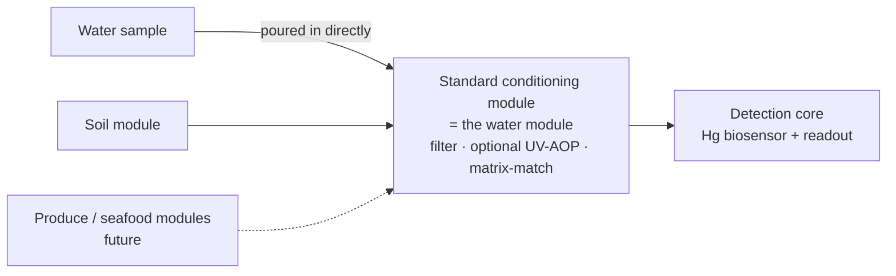

# Mercury Detection Platform — Open Hardware

An extensible mercury-detection platform built from three kinds of parts: a detection core (a mercury biosensor plus readout hardware), one standard conditioning module (the "water module") that every sample passes through, and pluggable upstream sample modules. Water samples go straight into the conditioning module. Solid samples are first turned into a crude liquid by their own upstream module; soil is the first one. The conditioning module filters every sample, matches it by weight to one standard liquid matrix and hands it to the detection core, so the core is calibrated once and a new sample type only needs a new upstream module. Agricultural-produce and seafood modules are future work. Built by a high-school iGEM 2026 team in Hong Kong.

> **Language note:** the documents are written in Traditional Chinese; the vision document is in colloquial Cantonese.

## Documents

| Document | Description |
| --- | --- |
| [00 – Vision: a water-first platform](docs/00-vision-water-first-platform.md) | Why we propose moving from "soil only" to a water-first platform with pluggable sample modules: architecture, benefits, honest claims and roadmap (colloquial Cantonese). |
| [01 – Soil NaCl extraction module](docs/01-soil-nacl-module.md) | Hardware plan for the first upstream module (route 1): weighs the soil, doses NaCl stock and chloride-free water by weight, stirs and settles, then hands the crude liquid to the conditioning module. |
| [02 – UV-AOP oxidation stage](docs/02-uv-aop-module.md) | Hardware plan for an optional insert inside the conditioning module (UV-C LEDs plus dilute H₂O₂, then catalase) that converts organic and complexed mercury to Hg²⁺ so the sensor can read it. |
| [03 – Standard conditioning (water) module](docs/03-water-module.md) | Hardware plan for the module every sample passes through: peristaltic sampling through a single-use path, 2 µm → 0.45 µm filtration, gravimetric matrix matching (buffer, NaCl, water) and a standard 15 mL output tube with metadata. Water samples are tested here directly. |

## Status

This project is at the **design stage**.

- The hardware has not been built yet.
- Extraction performance is predicted by modelling and has not been experimentally validated.
- The team has not performed any mercury-containing experiments.

## Safety

- The UV-AOP stage uses UV-C light, which is harmful to eyes and skin, and dilute hydrogen peroxide. It must be fully enclosed with a hardware interlock (a door switch in series with the LED supply, not only a software check); see section 7 of the UV-AOP document.
- Mercury-containing samples and waste require supervised laboratory handling. Used single-use tubing sets and the liquid used to clean the quartz tubes count as mercury waste.

## License

The documentation is licensed under [Creative Commons Attribution 4.0 International (CC BY 4.0)](LICENSE).
