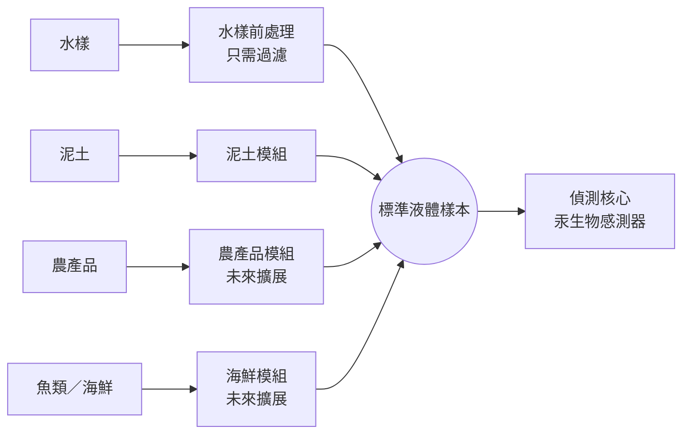
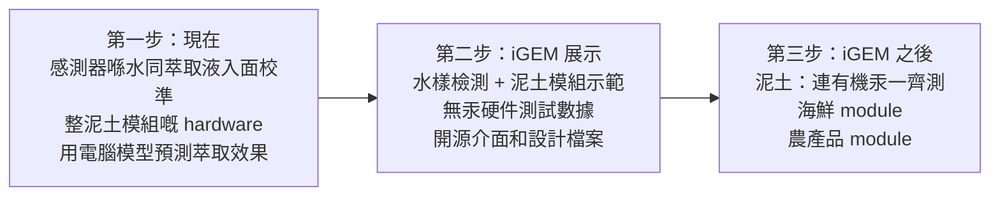

# 點解我建議由「淨係做泥土」改做「水為本平台」

我哋而家個方向係做泥土嘅汞萃取同檢測。我想提議一個再大少少、但係其實更易做嘅諗法：**用水樣檢測做核心，泥土變成第一個可以插上去嘅 module**。

先講清楚，**我唔係叫大家放棄泥土**。泥土仍然會係我哋 iGEM 最主要嘅 demo，只係我哋換個角度去睇成個 project。下面我會先講我心目中個平台係點，再講佢帶嚟乜嘢好處、點樣令大家做實驗方便好多，同埋大家可能會有嘅疑問。睇完有意見，直接喺文件度 comment 就得。

## 1　我嘅願景：一個可擴展嘅通用汞檢測平台

到時用家想測水，就直接倒水入去測；想測農田泥土，就插上泥土 module；將來想測街市啲魚，就插上海鮮 module。

**機身主體做一次、驗證一次就得，之後每多一種樣本要檢測，淨係需要多一個module。**

想像一部可以換鏡頭嘅相機：

- **機身**＝偵測核心：我哋個汞 biosensor 加讀數 hardware。佢淨係做一件事，就係量一杯液體入面有幾多汞。
- **鏡頭**＝萃取 module：每種樣本一個。佢負責將泥土、魚肉、菜呢啲固體樣本，變成一杯乾淨嘅液體，再交俾機身。
- **卡口**＝標準介面：所有 module 用同一套尺寸、電源、通訊同液體規格，插上去就用得。

呢個就係我講嘅「水為本、按需擴展」嘅通用汞檢測平台。

## 2　點解我覺得唔好淨係做泥土

泥土汞污染係真問題，選泥土冇錯。但係如果成個 project 淨係圍繞泥土，我哋會遇到幾個麻煩：

1. **泥土係最難搞嘅樣本。** 汞黏喺泥入面，要先萃取出嚟先測到，而且每種泥嘅成分都唔同。我哋等如將成個 project 押晒喺最難嗰部分。
2. **要證明有效，就要攞含汞泥土做實驗。** 即係要自己整汞污染泥土，仲要有 ICP-MS 呢啲準確儀器對照，先知到萃咗幾多出嚟。學校 lab 冇呢啲儀器，處理含汞泥土又危險，時間上都好趕。
3. **出事好難知係邊度出事。** 如果最後讀數唔啱，可以係萃取唔夠、泥入面啲嘢干擾咗感測器、或者感測器本身唔準，三樣混埋一齊。
4. **如果泥土嗰部分做唔掂，我哋就冇嘢 show。** 冇後備。
5. **用途窄。** 評審好可能會問：「同市面其他泥土測試有乜分別？之後可以點發展？」

## 3　呢個願景帶嚟嘅價值

|  | 淨係做泥土 | 水為本平台 |
| --- | --- | --- |
| 邊個會用 | 主要係農民 | 農民、魚塘養殖戶、食物安全、水質監測…… |
| 泥土部分做唔掂 | 冇嘢 show | 水樣檢測照樣係完整成果 |
| 實驗需要 | 含汞泥土 + 準確儀器 | 主要係水溶液實驗 |
| 將來發展 | 好難講 | 多一種樣本就多一個 module |

### 對用家

- **一部機，多種用途**。用家需要乜就加乜 module，唔使每種樣本買一部機。最貴嘅偵測部分共用，每個 module 只係樣本處理部分，整體成本會平啲。
- **水本身就有用**。飲用水、魚塘水、灌溉水都可能有汞，而且灌溉水正正係汞入農田嘅其中一條路，啱晒我哋農業嘅主題。水樣唔使萃取，係最快可以真係拎出去用嘅場景。

### 對我哋隊

- **實驗簡單好多**：下一節詳細講。
- **分工清楚**：感測器、萃取方法、hardware 三樣嘢可以分開同時做，唔使等對方。
- **風險低**：就算泥土嗰部分遇到困難，水樣檢測都已經係一個可以 demo 嘅成果。
- **易搵問題**：每部分分開驗證，就好似接力賽每一棒分開計時，邊棒慢就知邊棒出事。

### 對 iGEM

- **標準化同模組化係 iGEM 嘅核心精神**。iGEM 成個基礎就係「標準生物零件」，大家用同一套規格、可以自由組合。我哋將同一個諗法用喺 hardware 度，評審一睇就明，亦都睇到我哋有工程思考。
- **Human Practices 有更多人可以訪問**：農民、養殖戶、水質或食物安全專家。佢哋嘅意見仲可以直接變成「下一個 module 該做乜」嘅決定。
- **對其他隊有用**：好多 iGEM 隊都做 biosensor，但好少人處理「點樣將真樣本變成感測器讀到嘅液體」。我哋嘅介面同萃取 hardware 唔限於汞，其他隊可以攞去配自己嘅感測器。
- **將來發展有根據**：例如魚肉入面大部分係有機汞，如果我哋之後研究到點樣處理泥土入面嘅有機汞，同一套方法就可以拎去做海鮮 module。解決過嘅問題可以重用，呢就係模組化嘅好處。

每年嘅評審標準都會有少少變，寫 Wiki 之前要對返今年嘅 judging handbook。

## 4　實驗會方便好多

呢個係我覺得對大家最實際嘅好處。將「萃取」同「檢測」拆開之後，**wet lab 唔使再專登攞含汞泥土做實驗**，每部分用最簡單嘅方法驗證：

| 部分 | 要證明乜 | 點證明 | 要唔要含汞泥土 |
| --- | --- | --- | --- |
| 感測器（wet lab） | 測得準唔準、最低測到幾多 | 喺水（同萃取用嘅溶液）入面加已知分量嘅汞，畫校準曲線 | 唔使 |
| 萃取方法 | 可以萃到幾多汞、要幾耐 | 電腦模型預測（dry lab），再同文獻數據對照 | 唔使 |
| Hardware | 部機有冇照設計做 | 用普通泥、鹽水同色素測加液、攪拌、過濾同殘留 | 唔使 |
| 成套系統（選做） | 真泥土嘅回收率 | 搵合作實驗室做加標實驗 | 要，所以有時間先做 |

咁樣有幾個即時嘅好處：

- **安全**：學校 lab 淨係處理稀釋嘅汞標準溶液，唔使自己整同處理含汞泥土。
- **快**：水溶液實驗準備簡單、重複性高，一日可以做好多組。
- **唔使高級儀器**：感測器嘅校準只需要已知濃度嘅汞溶液，唔使每次都用大學嘅 ICP-MS 對照。
- **泥土嘅科學仍然有交代**：萃取效果可以由電腦模型預測，我已經初步研究過幾種萃取方法（例如用鹽溶液），之後可以再同大家詳細傾。有時間嘅話，最後再用真泥土實驗確認。

要注意一點：感測器嘅校準除咗喺純水度做，都要喺萃取用嘅溶液入面做一次，因為溶液成分會影響汞嘅形態同感測器嘅反應。不過呢個仍然係簡單嘅水溶液實驗。

## 5　對我哋而家嘅工作有乜影響

我知大家最擔心嘅係「係咪要重新做過」。其實唔使：

|  | 而家 | 改咗之後 |
| --- | --- | --- |
| 泥土 | 主角 | **照舊係主角**，變成第一個 module |
| 感測器 | 要證明喺泥土樣本入面有效 | 喺水同萃取溶液入面校準就得 |
| Wet lab 實驗 | 可能要用含汞泥土 | **主要做水溶液實驗** |
| Hardware | 一部泥土機 | 泥土 module + 一套標準介面（我已經開始設計） |
| 同評審講嘅故事 | 一部泥土測汞機 | 一個可以擴展嘅平台，泥土係第一個應用 |
| 其他樣本（海鮮、農產品） | 冇 | 只係設計同 roadmap，**iGEM 期間唔會做** |

簡單講：做嘅嘢差唔多，但係每樣要證明嘅嘢變得清楚咗、容易咗。

## 6　大家可能會問嘅問題

**「咁會唔會變咗做太多嘢？」**

唔會。iGEM 期間我哋只做兩樣：水樣檢測，同埋泥土 module。海鮮同農產品只係畫出嚟做設計同 roadmap，唔會真係整。由於 wet lab 唔使搞含汞泥土，工作量甚至會少咗。

**「咁泥土咪變咗配角？」**

唔係。泥土仍然係第一個、亦係唯一一個會真係整出嚟同 demo 嘅 module。分別只係講故事嗰陣，我哋先講成個平台點運作，再用泥土做實際例子。泥土由「成個 project」變成「平台第一個應用」，地位反而更清楚。

**「冇真泥土汞實驗，評審會唔會唔信？」**

呢個係合理嘅擔心，所以我哋要講得好誠實（見第 7 節）。感測器有實驗數據、hardware 有測試數據、萃取效果有模型預測，三樣加埋已經係一條完整嘅證據鏈，只係最後一步未有真泥土數據。有時間嘅話，可以搵合作實驗室補埋。反而如果堅持喺學校自己做含汞泥土實驗，最大機會係做唔切、或者數據唔夠準，更難令人信服。

**「水樣檢測會唔會太普通，冇乜新意？」**

單計水樣檢測的確唔算新，但我哋嘅重點唔係水，而係「一個核心 + 可換 module」呢個架構。水係個基礎，泥土 module 先係令我哋唔同嘅地方。

**「要改幾多嘢？會唔會拖慢進度？」**

改動好少：感測器校準多做一個萃取溶液版本；hardware 要跟一套介面（我已經開始設計）；主要改嘅係 Wiki 同 presentation 點樣講。唔使推翻任何已經做咗嘅嘢。

## 7　我哋點樣誠實咁講

「平台」呢個講法好吸引，但係講得太滿，評審一問就穿。所以我哋要分清楚「已經做到」同「設計上做得到」：

| 我哋會講 | 我哋唔會講 |
| --- | --- |
| 偵測核心已經喺水同萃取溶液入面驗證 | 個平台已經測到所有樣本 |
| 泥土 module 嘅 hardware 已經驗證，萃取效果由模型預測 | 泥土萃取率已經有實驗證明（除非真係做咗） |
| 海鮮同農產品 module 係設計同 roadmap | 海鮮同農產品 module 已經可以用 |
| 我哋測嘅係「萃取得出嚟嘅汞」 | 我哋測嘅係泥土入面所有汞 |

最後一點要解釋一下：泥土入面嘅汞唔係全部都會被植物吸收或者流走，有啲鎖得好實。萃取出嚟嘅嗰部分，往往先係真正有風險嘅部分，所以呢個其實係一個優點。但係法規標準多數計總汞，我哋嘅數字唔可以直接同法規標準比，要講明。

## 8　路線圖

原則好簡單：**每次淨係加多一個 module，而且要上一個穩定咗先加**。iGEM 期間我哋嘅目標係水樣檢測加泥土 module，證明「一個核心 + 可換 module」呢個設計行得通。海鮮同農產品就當係 future work 展示。

## 9　想大家一齊傾嘅嘢

- [ ] 大家覺得「水為本平台 + 泥土係第一個 module」呢個方向點？
- [ ] 萃取方法：我初步研究咗幾條路線，想搵時間同大家講解，再一齊決定
- [ ] Wet lab 可唔可以加做喺萃取溶液入面嘅校準
- [ ] 真泥土實驗做唔做；如果做，搵邊間合作實驗室
- [ ] Wiki 同 presentation 嘅架構由邊個跟

如果大家認同，我會跟住整理萃取方法同 hardware 嘅詳細資料俾大家睇。有唔同意見，直接喺文件度 comment，我哋再傾。
