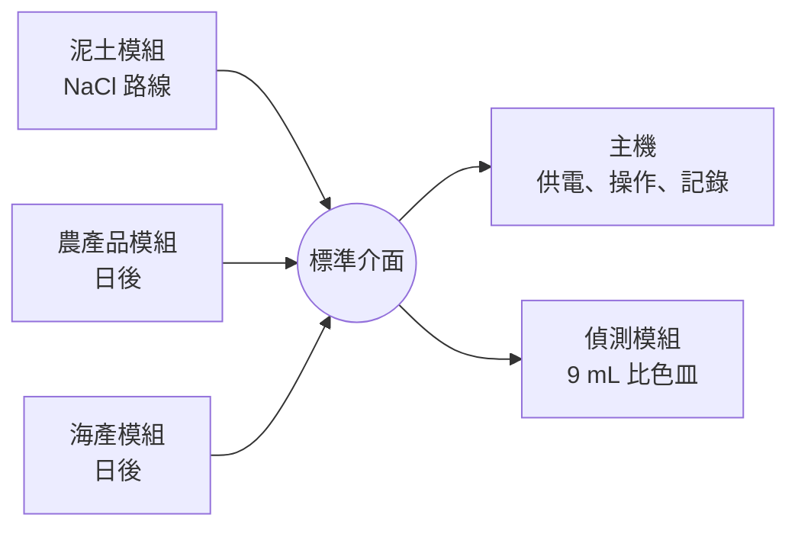
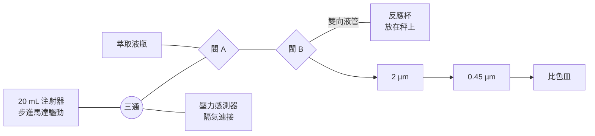
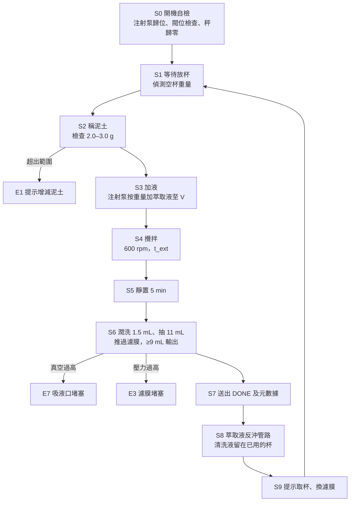

# 泥土 NaCl 自動萃取模組：硬件計劃書

## 1　摘要與目標

本計劃設計一個可插拔的泥土萃取模組（路線 1，NaCl 萃取）。使用者只需把約 2 g 泥土放入一次性反應杯、插入模組並按「開始」；稱重、加液、攪拌、靜置、兩級過濾、輸出萃取液及清洗管路全部自動完成。

| 目標 | 量化指標 |
| --- | --- |
| 全自動 | 使用者只做兩個動作：放入泥土杯、完成後取走泥土杯及換濾膜 |
| 萃取條件可重現 | 液固比 10 mL/g，誤差 ≤ 2%；NaCl 濃度由預配萃取液決定，配製誤差 ≤ 1% |
| 輸出 | 經 2 μm 及 0.45 μm 過濾的萃取液 ≥ 9 mL，送往偵測模組 |
| 可更換配方 | 萃取時間由軟件設定；NaCl 濃度以更換萃取液瓶設定，等乾實驗定案後直接更新 |
| 模組化 | 與日後的農產品、海產模組共用同一機械、流體、電氣及通訊介面 |

**核心設計決定**：模組用秤重取代體積量度，並用一個注射泵完成加液、抽液和過濾。反應杯下方的稱重感測器先量泥土重量，注射泵再按重量閉環加入預配的 NaCl 萃取液，所以使用者不需要準確秤泥，液固比仍然固定。

## 2　設計依據與規格

模組沿用乾實驗的液固比 10 mL/g，但把規模由 1 g／10 mL 放大至 2 g／20 mL。原因是偵測比色皿為 9 mL，10 mL 泥漿靜置後抽不到 9 mL 清液；液固比不變，化學條件就與乾實驗一致。

| 項目 | 設定 | 備註 |
| --- | --- | --- |
| 泥土量 | 2.0–3.0 g（建議約 2.5 g） | 少於 2 g 時液量不足以抽出 11 mL 而不吸入空氣 |
| 液固比 | 10 mL/g | 與乾實驗相同 |
| 總液量 | 10 × 泥土重量（20–30 mL） | 全部是預配 NaCl 萃取液 |
| NaCl 最終濃度 | 待乾實驗定案；佔位值 50 mM | 換瓶即換濃度 |
| 萃取液（預配） | 以無氯水配製，濃度即最終濃度（佔位 50 mM，2.92 g/L） | 注射泵按重量加入；亦用於清洗管路 |
| 無氯水 | 去離子水或蒸餾水 | 用於配製萃取液；水對照時直接換上水瓶 |
| 攪拌 | 3D 打印斜葉式攪拌棒，600 rpm | 需以泥土懸浮測試確認 |
| 萃取時間 | 預設 60 min，可設 5–60 min | 乾實驗會給出 5、15、30、60 min 曲線 |
| 靜置 | 5 min | 大於約 5 μm 的顆粒先沉降，減少堵膜 |
| 抽取 | 先以 1.5 mL 杯內清液潤洗管路，再抽 11 mL | 抽液後液面仍高於吸液口 |
| 過濾 | 2 μm 預過濾 → 0.45 μm | 兩種濾膜已備；每次更換 |
| 輸出 | ≥ 9 mL 濾液（體積由注射泵準確控制） | 送往偵測模組 |
| 溫度 | 室溫，記錄不控制 | 附溫度感測器 |

萃取液預先配成最終濃度，而不是用濃儲備液加水稀釋。原因是注射器和管路是共用的：如果用 10 倍儲備液，注射器內殘留 0.1 mL 儲備液，就會在加水時多帶入約 5% 的 NaCl。預配溶液無論殘留多少，濃度都不變，也少了一個試劑瓶。水對照模式（0 mM）只需換上無氯水瓶。

## 3　可插拔模組架構與標準介面

每個樣本模組（泥土、農產品、海產）只負責「樣本 → 過濾萃取液」，以同一套介面接上主機；主機負責供電、使用者操作及偵測。以後加新樣本，只需做一個新模組。

模組之間只透過介面交換萃取液、電力及訊息，內部設計可以完全不同。

| 介面 | 規格（建議） |
| --- | --- |
| 機械 | 統一底座面積及兩個定位銷；模組高度不限。第一版面積由泥土模組實測後定出，交與其他模組沿用 |
| 流體輸出 | 0.45 µm 濾器座的 Luer 出口；可直接滴入比色皿，或接短管到偵測模組 |
| 廢液 | 不需要廢液瓶：清洗液回推入已用的反應杯，隨杯棄置 |
| 電力 | 12 V DC，最大 2 A；模組內自備 5 V、3.3 V 降壓 |
| 通訊 | UART（115200 bps），文字指令；JST 4-pin：12 V、GND、TX、RX |
| 模組識別 | 開機時回報模組類型、韌體版本及目前配方 |

指令集（所有模組共用）：

| 指令 | 作用 |
| --- | --- |
| ID? | 回報模組類型（例如 SOIL-NACL）及版本 |
| CFG | 設定配方：萃取液標示濃度、萃取時間、輸出體積 |
| START | 開始一次萃取 |
| STATUS? | 回報目前步驟、剩餘時間、錯誤碼 |
| DONE（模組發出） | 萃取液已送出，附泥土重量、液量、溫度 |
| ABORT | 停止注射泵及攪拌，液體留在杯內 |

第一版先讓泥土模組自備按鈕及小螢幕，可在未有主機時獨立運作；主機完成後改由 UART 控制。

## 4　子系統設計

模組由五個子系統組成：反應杯與稱重、攪拌、注射泵與閥、吸液口與過濾、控制電子。所有接觸樣本的部件只用 PP、PE、PTFE、尼龍濾布、濾膜及經測試的 PETG 和旋塞塑料，液體不接觸金屬。

一個注射泵取代原本的三個蠕動泵、兩個夾管閥和廢液瓶。注射器拉時吸液、推時送液；閥 A 選擇「萃取液瓶」或「閥 B」，閥 B 選擇「反應杯」或「濾膜」。杯的液管是雙向的：加液和抽液都經同一條管。

### 4.1　反應杯與稱重

- 一次性平底 PP 杯，內徑 30–35 mm、容量 ≥ 40 mL。平底可令泥土平鋪，比錐底容易攪起。內徑 32 mm 時，20 mL 液深約 25 mm。
- 杯放在 3D 打印杯座上，杯座安裝在 100 g 稱重感測器（HX711，解析度約 0.01 g）。同一個感測器先量泥土，再閉環控制加液。
- 杯蓋固定在模組上，有三個孔：攪拌軸、雙向液管（加液和抽液共用）、通氣孔。液管不接觸杯壁，避免影響稱重。

### 4.2　攪拌（3D 打印攪拌棒）

- 頂置式攪拌：N20 減速馬達（12 V、600 rpm，附編碼器），用 PWM 加編碼器閉環穩速。
- 攪拌棒與軸一體打印：軸徑 5 mm；四葉 45° 斜葉槳，直徑 16 mm（約杯徑一半），向下推流以捲起底部泥土；葉輪距杯底 4–5 mm。600 rpm 時葉尖速度約 0.5 m/s。
- 材料：PETG，100% 填充，打印後打磨；以印製聯軸器接馬達 D 型軸。攪拌棒可拆洗及更換。
- 是否需要 600 rpm，要以普通泥土加水做懸浮測試確認（見第 7 節）。

### 4.3　注射泵與閥（加液、抽液、過濾共用）

| 動作 | 閥 A | 閥 B | 注射器 |
| --- | --- | --- | --- |
| 由瓶吸萃取液 | 接瓶 | — | 拉 |
| 加液入杯 | 接閥 B | 接杯 | 推 |
| 由杯抽液 | 接閥 B | 接杯 | 拉 |
| 過濾輸出 | 接閥 B | 接濾膜 | 推 |
| 清洗 | 先接瓶（拉），再接閥 B（推） | 接杯 | 先拉後推 |

**為甚麼不用止回閥**：止回閥只能分「入」和「出」，但這裡有兩個來源（瓶、杯）和兩個去向（杯、濾膜）。即使加了兩個止回閥，仍要一個閥選來源、一個閥選去向，閥的數目沒有減少。止回閥還有三個缺點：泥土細粒卡住閥片會漏液；開啟壓力會增加抽吸阻力，容易抽出氣泡；三通位置多了死體積。不用止回閥時，杯的液管可以雙向使用，加液時液體由吸液口流出，順便反沖 50 µm 濾布。

- **注射器**：20 mL Luer-lock。建議用沒有橡膠活塞的兩件式 PP/PE 注射器，汞不會吸附在橡膠上，而且便宜，可定期更換。針嘴向上安裝：氣泡會先被推出，泥土細粒則沉在活塞一端。活塞柄要雙向夾緊，因為泵要拉也要推。
- **驅動**：NEMA17 步進馬達 + T8 絲杆（導程 2 mm）+ TMC2209 驅動 + 限位開關歸位。以注射器內徑約 20 mm 計，每微步約 0.2 µL；150 kPa 時活塞力約 50 N，所需扭矩遠低於 NEMA17 的能力。實際每步體積以重量法校準。
- **閥**：兩個醫用三通旋塞（Luer 接口），各由一個 MG90S 伺服馬達經 3D 打印支架轉動。旋塞便宜、耐壓，液體不接觸金屬，並可直接接 Luer 注射器和濾器座。
- **壓力感測器**：以三通接在注射器與閥 A 之間，經一段困住空氣的短管連接，液體不會接觸感測器。抽液時真空超過 −40 kPa（吸液口堵塞，會抽出氣泡）即停；推液時超過 150 kPa（濾膜堵塞）即停。
- **流速**：由杯抽液 ≤ 5 mL/min，以免攪起沉積泥；過濾 2–3 mL/min；加液可達 20 mL/min。
- **加液**：先按注射器體積推到目標的 90%，再每次 0.1 mL 逼近，每步等秤讀數穩定；超過 18 mL 分兩次抽推。秤和注射器互相核對，其中一個出錯會被發現。

### 4.4　吸液口、管路與過濾

- **吸液頭**：用現有的 8 mm PTFE 管剪 1–1.5 cm，外包 50 µm 尼龍濾布（以 PTFE 線或熱縮管固定），下端離杯底 8 mm，再接細管。比直接把濾布包在細管口的面積大得多，較不易堵。
- **樣本管路要細而短**：用小口徑 PTFE 管（例如外徑 3 mm × 內徑 2 mm，每 cm 約 0.03 mL），杯至閥 B 約 15 cm（約 0.5 mL）。8 mm 管若內徑約 7 mm，每 cm 約 0.38 mL，15 cm 已有約 5.8 mL，接近樣本量的一半，所以只適合做吸液頭或萃取液瓶的吸管。
- **接頭**：PTFE 管較硬，套在寶塔接頭上不易密封；用 1/4-28 平底接頭配 Luer 轉接頭，或在接口外加熱縮管。
- **濾膜組**：現有的 25 mm 濾器座（2 µm 和 0.45 µm）以 Luer 直接串接，再直接接在閥 B 的濾膜口上，不用軟管（若濾器座不是 Luer 接口，則用最短的細 PTFE 管連接）。兩張濾膜每次運行都換新；建議準備兩套濾器座輪流使用，一套使用時另一套清洗晾乾。
- **取消「首 1 mL 棄去」**：濾膜和濾器座每次都是乾的，濾液不會被管內殘液稀釋，所以不再需要廢液閥。新濾膜對汞的吸附損失由 7.2 測試確認；若損失 > 5%，再加第三個閥把首 1 mL 濾液導走。
- **輸出**：0.45 µm 濾器座出口直接滴入比色皿。推出的體積由注射泵控制，扣除濾器座保留量（校準得出）即為輸出體積。

### 4.5　控制電子

| 部件 | 用途 |
| --- | --- |
| ESP32 開發板 | 狀態機、UART 介面、記錄 |
| TMC2209 + NEMA17 + 限位開關 | 注射泵 |
| MG90S 伺服馬達 × 2 | 轉動兩個三通旋塞 |
| DRV8833（或 MOSFET） | 攪拌馬達 |
| HX711 + 100 g 稱重感測器 | 秤泥及加液 |
| 壓力感測器（表壓 −100 至 +200 kPa） | 抽液真空及過濾壓力 |
| DS18B20 | 記錄溫度 |
| 0.96" OLED + 2 個按鈕 + 蜂鳴器 | 獨立操作 |
| 12 V 2 A 電源 + 5 V 3 A 降壓 | 供電；伺服馬達用 5 V |

## 5　自動化流程與控制邏輯

韌體以狀態機運行，每個狀態有明確的進入條件、完成條件和超時。使用者只需要做兩件事：放入裝有泥土的杯，以及完成後取走杯和更換兩張濾膜。

### 5.1　各狀態細節

1. **S0 自檢**：注射泵靠限位開關歸位；兩個閥轉過每個位置；壓力感測器讀零；秤在無杯狀態歸零；檢查萃取液瓶是否足夠至少 5 次運行。每日首次運行時，提示放一個預充杯，由瓶抽萃取液把管路推滿，預充杯之後棄去。
2. **S1 放杯**：偵測到 5–15 g 的重量躍升並穩定 3 秒，視為空杯已放入，記錄杯重後再次歸零。
3. **S2 稱泥土**：使用者加泥土並按「開始」；讀數穩定（連續 2 秒變化 < 5 mg）後記錄 m\_soil。不在 2.0–3.0 g 即報 E1。
4. **S3 加液**：計算目標液量 V = 10 × m\_soil（mL）。注射泵由瓶抽萃取液，經閥 A、閥 B 和液管推入杯中；先按體積推到 90%，再每次 0.1 mL 逼近，每步等秤讀數穩定。V > 18 mL 時分兩次。加液時停止攪拌。稀 NaCl 溶液密度約 1.00 g/mL，韌體仍按校準值換算。
5. **S4 攪拌**：編碼器閉環控制 600 rpm（±5%），計時 t\_ext（預設 60 min，5–60 min 可設）。每分鐘記錄轉速；轉速長時間低於 80% 目標即報 E2。
6. **S5 靜置**：停止攪拌 5 min，讓泥土沉到杯底。
7. **S6 抽取與過濾**：(a) 以 ≤ 5 mL/min 由杯抽 1.5 mL 再推回杯，用樣本潤洗注射器、閥和液管；(b) 抽 11 mL；(c) 閥 B 轉到濾膜，以 2–3 mL/min 推過 2 µm 及 0.45 µm，濾液直接滴入比色皿，輸出 ≥ 9 mL。抽液時真空超過 −40 kPa 報 E7；推液時壓力超過 150 kPa 報 E3。
8. **S7 完成**：透過 UART 送出 DONE，附帶元數據：泥土重量、實際液量、萃取液標示濃度、萃取時間、平均轉速、溫度、輸出體積、最高壓力、錯誤記錄。
9. **S8 沖洗**：由瓶抽 3 mL 萃取液，經液管推入已用的杯，重複 2 次。清洗液留在杯中，隨杯棄置；管路之後保持充滿萃取液，準備下一次運行。
10. **S9 等待維護**：OLED 提示取走杯（連泥土和清洗液按汞廢物處理），取下濾膜組並換上新的 2 µm 和 0.45 µm 濾膜；按鍵確認後回到 S1。

### 5.2　錯誤代碼

| 代碼 | 情況 | 處理 |
| --- | --- | --- |
| E1 | 泥土重量不在 2.0–3.0 g | 提示增減泥土，不進入加液 |
| E2 | 攪拌轉速過低或編碼器無訊號 | 停機，提示檢查葉輪 |
| E3 | 過濾壓力過高（堵塞） | 停泵，提示更換濾膜；已送出的濾液標記為不完整 |
| E4 | 加液超時或超量（>+5%） | 停泵，標記樣本無效 |
| E5 | 儲液瓶不足 | 開始前拒絕運行 |
| E6 | 秤讀數不穩或漂移 | 重新歸零後重試一次，仍失敗則停機 |
| E7 | 抽液真空過高（吸液口或濾布堵塞） | 停泵，把已抽的液推回杯，延長靜置後重試一次 |

### 5.3　特別模式

- **水對照模式**：把萃取液瓶換成無氯水瓶（萃取前先用水預充管路），用於量度水溶性部分。
- **無泥土空白**：不加泥土，按 2.5 g 等效量加液和運行全流程，用於檢查管路、閥、注射器、濾膜和攪拌棒的汞殘留或釋出。
- **手動模式**：注射泵、閥和攪拌可單獨測試，用於校準和除錯。
- **校準模式**：用已知重量砝碼校秤；注射泵以重量法校正每步體積；記錄濾器座保留量；校正兩個伺服的閥位角度。

## 6　物料清單與成本估算

以下價格為粗略估算（港幣，以電商零售價估計），落單前需報價。已有的 2 µm 和 0.45 µm 濾膜不計入。

| 類別 | 項目 | 數量 | 估計（HK$） | 備註 |
| --- | --- | --- | --- | --- |
| 控制 | ESP32 開發板 | 1 | 40 | 內置 UART、PWM |
| 攪拌 | N20 12 V 600 rpm 編碼器減速電機 | 1 | 30 | 閉環轉速 |
| 注射泵 | NEMA17 + T8 絲杆（導程 2 mm）+ 導軸軸承 + 限位開關 | 1 套 | 120–200 | 支架及活塞夾 3D 打印 |
| 驅動 | TMC2209 + DRV8833 | 各 1 | 45 | 步進馬達及攪拌 |
| 注射器 | 20 mL Luer-lock 兩件式 PP/PE 注射器 | 20 | 40–80 | 定期更換 |
| 閥 | 醫用三通旋塞（Luer） | 4 | 20–40 | 2 個使用、2 個備用 |
| 閥驅動 | MG90S 伺服馬達 | 2 | 40–60 |  |
| 稱重 | 100 g 荷重元 + HX711 | 1 | 30 | 需防濺水 |
| 感測 | 壓力感測器（−100 至 +200 kPa） | 1 | 30–80 | 隔氣連接 |
| 感測 | DS18B20 防水溫度探頭 | 1 | 15 |  |
| 管路 | 小口徑 PTFE 管、Luer 及 1/4-28 接頭、50 µm 尼龍濾布 | 1 套 | 60–100 | 8 mm PTFE 管已有 |
| 過濾 | 25 mm 濾器座 | 已有 | 0–80 | 可加購一套輪流使用 |
| 杯 | PP 平底杯 | 50 | 50–100 | 拋棄式 |
| 儲液 | 500 mL PP 或 HDPE 瓶 | 2 | 20 | 萃取液、水對照 |
| 人機介面 | 0.96″ OLED、按鍵、蜂鳴器 | 1 套 | 30 |  |
| 電源 | 12 V 2 A 電源 + 5 V 3 A 降壓模組 | 1 套 | 60 |  |
| 結構 | PETG 線材 | 1 kg | 100–150 |  |
| 雜項 | 螺絲、線材、連接器、洞洞板 | — | 50–100 |  |
| **合計** |  |  | **約 780–1,260** | 未計運費；不含濾膜 |

成本與蠕動泵版本相近，改用注射泵的好處不在省錢，而在於：零件數目少、沒有會老化的泵管、體積準確度高（每步約 0.2 µL），而且不再需要廢液瓶。濾膜每次兩張，是主要的消耗品。預算可以 HK$1,500 為上限（含備用料）。之後的農產品或海鮮模組可沿用同一套電子、秤和注射泵，只更換樣本處理部件。

## 7　測試與驗證計劃

測試分兩階段：先用不含汞的替代樣本驗證硬件性能，最後才經合作實驗室做含汞測試。這樣大部分除錯不需要處理 HgCl₂。

### 7.1　無汞測試（團隊自行進行）

| 測試 | 方法 | 合格標準 |
| --- | --- | --- |
| T1 秤準確度 | 1–20 g 砝碼各量 10 次；放置 60 min 觀察漂移 | 誤差 ≤ ±10 mg；60 min 漂移 ≤ 20 mg |
| T2 加液準確度 | 以空杯運行 S3 共 10 次，用外部天平複秤 | L/S 誤差 ≤ 2%，CV ≤ 1% |
| T3 NaCl 濃度 | 以電導率計量測最終溶液，對照手配標準曲線 | 誤差 ≤ 3% |
| T4 懸浮效果 | 普通泥土 2 g，分別在 300、450、600 rpm 錄影，觀察杯底是否有靜止泥層 | 600 rpm 時杯底無長期靜止泥層；無液體濺出 |
| T5 轉速穩定 | 泥漿中連續運行 60 min，記錄編碼器轉速 | 平均轉速 600 ± 5% |
| T6 沉降與過濾 | 多種泥土（沙質、壤土、黏土較多）各 3 次，記錄過濾時間、最高壓力、收集體積 | ≥9 mL 在 10 min 內完成；濾液清澈 |
| T7 殘留（carryover） | 先跑高濃度 NaCl 或食用色素，再跑無泥土空白，量測空白的電導率或吸光度 | 殘留 ≤ 0.5% |
| T8 連續運行 | 連續 10 次完整流程 | 無漏液、無未處理的錯誤 |

### 7.2　含汞測試（經合作實驗室進行）

- **材料吸附測試**：把 PETG 打印件、注射器、三通旋塞、PTFE 管、尼龍濾布和兩種濾膜分別浸在含已知 Hg(II) 的 NaCl 溶液中，比較浸泡前後的濃度（以 CVAAS 或 ICP-MS 量測）。目標是整套路徑損失 ≤ 5%；特別要確認新濾膜的損失，因為設計已取消「首 1 mL 棄去」。
- **空白**：無泥土空白的汞濃度需低於偵測模組的偵測下限。
- **加標回收**：在乾淨泥土中加入已知量 Hg(II)，比較模組萃取結果與手動萃取（同樣 NaCl 濃度、L/S、時間）的結果。兩者差異 ≤ 10% 即視為硬件沒有引入額外偏差。
- **重複性**：同一泥土 5 次重複，CV ≤ 10%。

所有含汞操作須在有導師監督和合適通風設備的實驗室進行，廢液按實驗室規定處理。

## 8　風險、限制與待決事項

### 8.1　技術風險

| 風險 | 影響 | 緩解 |
| --- | --- | --- |
| 汞吸附在打印件、矽膠管或濾膜上 | 結果偏低；下一樣本被污染 | 樣本路徑用 PTFE、PP/PE，不用矽膠管和橡膠活塞；每次換新濾膜；完成後沖洗；7.2 吸附測試確認；如新濾膜損失 > 5%，加第三個閥棄去首 1 mL 濾液；必要時葉輪改用 PP 或加 PTFE 塗層 |
| 濾膜堵塞 | 濾液不足 9 mL | 靜置 5 min、兩級過濾、壓力監察；黏土較多的泥土可延長靜置時間 |
| 秤漂移或受振動影響 | L/S 不準 | 加液時停止攪拌、等讀數穩定；電機支架與秤分開安裝；每次運行前歸零 |
| 葉輪把泥土打成微粒 | 濾膜較易堵塞；表面積增加改變萃取結果 | 600 rpm 、葉尖速度約 0.5 m/s，屬溫和攪拌；葉輪離杯底 4–5 mm |
| 注射器活塞磨損（泥土細粒） | 漏液、體積不準 | 靜置後才抽液，先經 50 µm 濾布；針嘴向上安裝；加液有秤核對，體積偏差會被發現；注射器便宜，定期更換 |
| 伺服閥位不準或旋塞漏液 | 液體流向錯誤 | 校準模式記錄每個閥位角度；壓力感測器可發現「該有阻力卻沒有」的情況；旋塞有備用 |

### 8.2　科學與測量限制

- **與偵測模組的相容性**：濾液含 NaCl，汞主要以氯化物錯合物（如 HgCl₄²⁻）存在。生物感測器需要在同樣 NaCl 背景下做校準曲線。NaCl 濃度若不超過約 170 mM（與 LB 培養基相近），對大腸桿菌感測器應較易兼容，但需濕實驗確認。
- **溫度**：模組不控溫，只記錄溫度。室溫差異可能影響萃取速率，需在數據分析時考慮。
- **泥土含水量**：模組稱的是濕重。若要以乾重表示結果，需另外測含水量，或要求使用者先風乾過篩。

### 8.3　安全

- 萃取液只含 NaCl，不含汞；模組本身不儲存汞試劑。
- 已用的反應杯（含泥土和清洗液）及用過的濾膜需上蓋或封袋，按實驗室汞廢物規定處理。
- 12 V 低壓設計，液體區與電子區分開，電子區位於上方或側邊並有防濺蓋。

### 8.4　待決事項

- [ ] NaCl 最終濃度（等乾實驗結果；目前佔位 50 mM）
- [ ] 預設萃取時間（等動力學模型；目前預設 60 min）
- [ ] 偵測模組實際需要的濾液體積和接收方式（比色皿、試管或直接流入）
- [ ] 泥土是否需要先風乾和過篩（例如 2 mm）
- [ ] 合作實驗室與含汞測試的時間
- [ ] 確認現有 25 mm 濾器座是否為 Luer 接口，以及 8 mm PTFE 管的實際內徑
