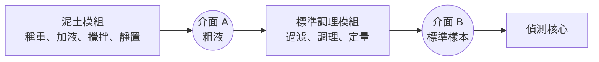
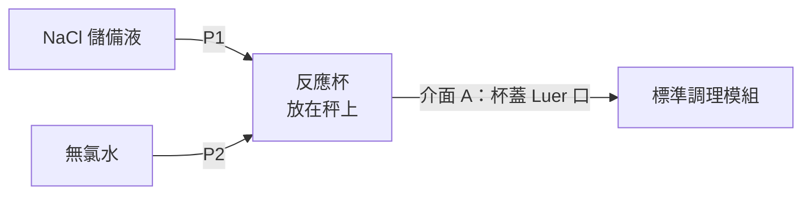
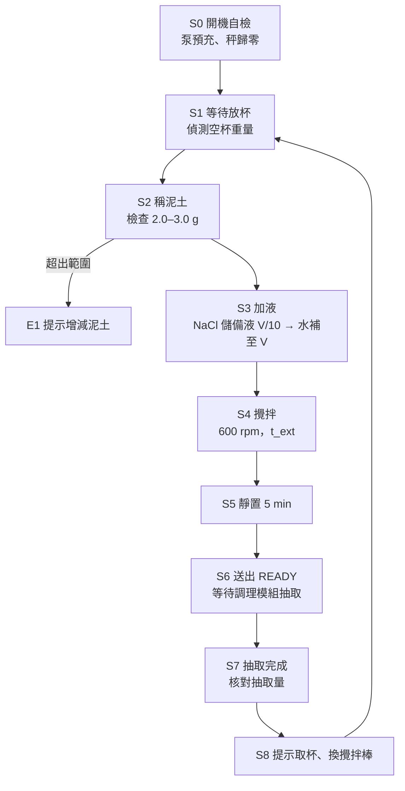

# 泥土 NaCl 自動萃取模組：硬件計劃書

## 1　摘要與目標

本模組只負責一件事：把泥土變成「粗液」（路線 1，NaCl 萃取）。使用者把約 2.5 g 泥土放入一次性反應杯、按「開始」；模組自動稱重、按重量加入 NaCl 儲備液和無氯水、攪拌萃取、靜置，然後通知標準調理模組來抽取。過濾、定量和基質調理全部由標準調理模組統一處理（見該計劃書）。

| 目標 | 量化指標 |
| --- | --- |
| 全自動 | 使用者只做兩個動作：放入泥土杯；完成後取走杯、換攪拌棒 |
| 萃取條件可重現 | 液固比 10 mL/g，誤差 ≤ 2%；NaCl 最終濃度誤差 ≤ 3% |
| 交出粗液 | 靜置後可經介面 A 抽取 ≥ 12 mL，不吸入空氣或沉積泥 |
| 乾淨與髒路徑分開 | 試劑管路永不接觸樣本 |
| 可更換配方 | NaCl 濃度與萃取時間由軟件設定；換試劑瓶即可跑路線 2 的半胱氨酸萃取 |

### 1.1　核心設計決定

- **用秤重取代體積量度**。先量泥土重量，再按重量閉環加液，所以使用者不需要準確秤泥，液固比仍然固定。
- **乾淨路徑與髒路徑分開**。兩個試劑泵只接觸乾淨試劑，滴嘴不碰液面；樣本只接觸拋棄式杯、攪拌棒和調理模組的一次性吸液頭。
- **放棄單一注射泵方案**。曾經考慮用一支注射泵完成加液、抽液和過濾。但同一支注射器先抽含汞萃取液、再抽下一次的試劑，殘留無法完全沖走（NaCl 溶液本身就會把管壁上的汞洗出來），所以改回獨立的試劑泵。而注射泵的主要優勢（體積準）對本模組意義不大，因為加液本來就靠秤重閉環。
- **抽取和過濾不在本模組做**。這些步驟對所有樣本都一樣，所以集中由標準調理模組處理；本模組因此少了樣本泵、濾器、閥和壓力感測器。

## 2　設計依據與規格

液固比沿用乾實驗的 10 mL/g。規模定為 2–3 g 泥土、總液量 20–30 mL，原因是調理模組要抽約 12 mL（約 10–11 g 濾液加管組保留量），抽完後液面仍要高於吸液頭。液固比不變，化學條件就與乾實驗一致。

| 項目 | 設定 | 備註 |
| --- | --- | --- |
| 泥土量 | 2.0–3.0 g（建議約 2.5 g） | 少於 2 g 時液量不足以抽取 12 mL |
| 液固比 | 10 mL/g | 與乾實驗相同 |
| 總液量 | 10 × 泥土重量（20–30 mL） | NaCl 儲備液 + 無氯水 |
| NaCl 最終濃度 | 待乾實驗定案；佔位 50 mM，支援 10–100 mM | 同時是平台的標準 NaCl 濃度 c\* |
| NaCl 儲備液 | 最終濃度的 10 倍（佔位 0.50 M，29.2 g/L） | 每次加入總液量的 1/10 |
| 無氯水 | 去離子水或蒸餾水 | 補足總液量；水對照時只加水 |
| 攪拌 | 3D 打印斜葉式攪拌棒，600 rpm | 需以泥土懸浮測試確認 |
| 萃取時間 | 預設 60 min，5–120 min 可設 | 乾實驗會給出 5、15、30、60 min 曲線 |
| 靜置 | 5 min | 大於約 5 µm 的顆粒先沉降 |
| 交接 | 經杯蓋 Luer 口由調理模組抽取 | 抽取流速 ≤ 5 mL/min |
| 溫度 | 室溫，記錄不控制 | 附溫度感測器 |

**為何用 10 倍儲備液**：令每次加入的量維持約 2–3 mL，稱重解析度 0.01 g 對 2 g 即 0.5%。如果改用共用的 1 M 儲備液，10 mM 時只需 0.2 mL，誤差會升至約 5%。兩條試劑管路各自獨立、永不接觸樣本，所以儲備液不會被稀釋或污染，可以放心用儲備液加水的做法，也方便測試不同 NaCl 濃度。

**路線 2 怎樣跑**：把 P1 的試劑瓶換成 10 倍半胱氨酸儲備液，配方改用較長的萃取時間、基質代碼改為 SOIL-CYS，其餘硬件完全不變。之後調理模組插上 UV-AOP 段即可（見 UV-AOP 計劃書）。

## 3　在平台中的位置與介面

本模組是平台的一個上游模組。它只交出「粗液」（介面 A），由標準調理模組抽取、過濾、調理成標準樣本（介面 B）後，再交給偵測核心。

| 介面 | 規格 |
| --- | --- |
| 機械 | 統一底座面積及兩個定位銷，與調理模組並排放置 |
| 流體 | 杯蓋一個 Luer 口；吸液頭與接管屬於調理模組的一次性樣本管組，每次更換 |
| 電力 | 自備 12 V 2 A 電源，不由其他模組供電；模組內 5 V、3.3 V 降壓 |
| 通訊 | UART（115200 bps），文字指令；JST 4-pin：GND、TX、RX，第 4 腳保留不接 |
| 模組識別 | 開機時回報基質代碼（路線 1 為 SOIL-NACL，路線 2 為 SOIL-CYS）、韌體版本及目前配方 |

指令集（所有上游模組共用）：

| 指令 | 作用 |
| --- | --- |
| ID? | 回報模組類型及版本 |
| CFG | 設定配方：NaCl 濃度、萃取時間 |
| START | 開始一次萃取 |
| STATUS? | 回報目前步驟、剩餘時間、錯誤碼 |
| READY（模組發出） | 粗液已靜置可抽取；附基質代碼、NaCl 濃度、泥土重量、液量、溫度、最大抽取流速 |
| PULLED（主機發出） | 調理模組已抽取完畢，附抽取量 |
| ABORT | 停止加液及攪拌，液體留在杯內 |
| DONE（模組發出） | 本次運行完成；附元數據（泥土重量、實際液量、NaCl 最終濃度、接觸時間、轉速、溫度、抽取量、錯誤記錄） |

第一版自備按鈕及小螢幕，可在未有主機時獨立運作；主機完成後改由 UART 控制。

## 4　子系統設計

模組由四個子系統組成：反應杯與稱重、攪拌、試劑定量、控制電子。接觸樣本的只有拋棄式杯、攪拌棒和調理模組的一次性吸液頭。

### 4.1　反應杯與稱重

- 一次性平底 PP 杯，內徑 30–35 mm、容量 ≥ 40 mL。平底令泥土平鋪，比錐底容易攪起。內徑 32 mm 時，20 mL 液深約 25 mm。
- 杯放在 3D 打印杯座上，杯座裝在 100 g 稱重感測器（HX711，解析度約 0.01 g）上。同一個感測器先量泥土、再閉環加液，最後還用來核對調理模組抽走了多少。
- 杯蓋固定在模組上，有五個孔：攪拌軸、P1 滴嘴、P2 滴嘴、通氣孔、交接用 Luer 口。滴嘴懸在液面上方，不接觸液體和杯壁，既不影響稱重，也保證試劑管路不被污染。
- 交接用的吸液頭由 Luer 口插入，貼近杯壁，管口離杯底 8 mm。2.5 g 泥土沉積層約 2–3 mm 厚，管口不會吸入沉積泥。

### 4.2　攪拌（3D 打印攪拌棒）

- 頂置式攪拌：N20 減速馬達（12 V、600 rpm，附編碼器），用 PWM 加編碼器閉環穩速。
- 攪拌棒與軸一體打印：軸徑 5 mm；四葉 45° 斜葉槳，**直徑 14 mm**，向下推流以捲起底部泥土；葉輪距杯底 4–5 mm。600 rpm 時葉尖速度約 0.44 m/s。
- **為何是 14 mm**：吸液頭要放在葉輪旁邊、同一高度。杯內徑 32 mm，14 mm 葉輪外緣在半徑 7 mm，留 2 mm 間隙，外徑 ≤ 5 mm 的吸液頭就剛好放得下。用 16 mm 葉輪或 8 mm 粗的吸液頭就會碰在一起。
- 材料：PETG，100% 填充，打印後打磨。
- **攪拌棒是本模組唯一一個重複使用又接觸樣本的部件**。所以用快拆聯軸器，每次運行換一支（打印成本約 HK$1），或準備數支輪流清洗；哪一種做法由第 7 節的 T8 決定。
- 是否需要 600 rpm，要以普通泥土加水做懸浮測試確認。

### 4.3　試劑定量

- 兩個 12 V 蠕動泵：P1 加 NaCl 儲備液，P2 加無氯水；儲液瓶各 500 mL。
- 秤重閉環：加液時停止攪拌；先快速加到目標的 90%，再以短脈衝補足；韌體寫入兩種液體的密度，把重量換算成體積。
- 每次先加 NaCl 儲備液（總液量的 1/10，約 2–3 mL），再加水至總液量。
- 兩條管路只接觸乾淨試劑，泵管老化只會令流量漂移，秤重閉環會自動補償，不影響準確度。泵管定期更換即可。

### 4.4　交接（介面 A）

- 靜置完成後，模組送出 READY，附 NaCl 濃度、泥土重量、液量、溫度和最大抽取流速（5 mL/min）。
- 調理模組經杯蓋 Luer 口抽取約 12 mL。期間本模組保持停止攪拌、不加液，並以秤記錄杯內重量下降，可與調理模組回報的抽取量互相核對。
- 抽取完畢（主機送 PULLED）後，提示使用者取走杯（連泥土與剩餘萃取液按汞廢物處理）並更換攪拌棒。
- 本模組不需要沖洗步驟和廢液瓶：試劑管路從未接觸樣本，接觸樣本的部件全部隨杯、攪拌棒或管組更換。

### 4.5　控制電子

| 部件 | 用途 |
| --- | --- |
| ESP32 開發板 | 狀態機、UART 介面、記錄 |
| MOSFET 模組 × 2 | P1、P2 |
| DRV8833（或 MOSFET） | 攪拌馬達 |
| HX711 + 100 g 稱重感測器 | 秤泥、加液、核對抽取量 |
| DS18B20 | 記錄溫度 |
| 0.96" OLED + 2 個按鈕 + 蜂鳴器 | 獨立操作 |
| 12 V 2 A 電源 + 5 V 降壓 | 供電 |

## 5　自動化流程與控制邏輯

韌體以狀態機運行，每個狀態有明確的進入條件、完成條件和超時。

### 5.1　各狀態細節

1. **S0 自檢**：放一個預充杯，P1、P2 各泵約 1 mL 排走氣泡，並以秤確認兩個泵都有出液；秤在無杯狀態歸零；檢查儲液瓶夠至少 5 次運行。
2. **S1 放杯**：偵測到 5–15 g 的重量躍升並穩定 3 秒，視為空杯已放入，記錄杯重後再次歸零。
3. **S2 稱泥土**：使用者加泥土並按「開始」；讀數穩定（連續 2 秒變化 < 5 mg）後記錄 m\_soil；不在 2.0–3.0 g 即報 E1。
4. **S3 加液**：V = 10 × m\_soil（mL）。先加 NaCl 儲備液 V/10，再加無氯水至 V。每種液體先快速泵至目標的 90%，再以小脈衝逼近；加液時停止攪拌；以密度換算（儲備液 ρ ≈ 1.02 g/mL，水 ≈ 1.00 g/mL）。
5. **S4 攪拌**：編碼器閉環控制 600 rpm（±5%），計時 t\_ext（預設 60 min）；每分鐘記錄轉速；轉速長時間低於目標的 80% 即報 E2。
6. **S5 靜置**：停止攪拌 5 min，讓泥土沉到杯底。
7. **S6 交接**：送出 READY，等待調理模組抽取；期間以秤記錄杯內重量下降。
8. **S7 完成**：收到 PULLED 後，由重量差計算實際抽取量，與調理模組回報值交叉核對；送出 DONE 與元數據（泥土重量、實際液量、NaCl 最終濃度、實際接觸時間、平均轉速、溫度、抽取量、錯誤記錄）。
9. **S8 等待維護**：提示取走杯（連泥土和剩餘萃取液按汞廢物處理）、更換攪拌棒；按鍵確認後回到 S1。

### 5.2　錯誤代碼

| 代碼 | 情況 | 處理 |
| --- | --- | --- |
| E1 | 泥土重量不在 2.0–3.0 g | 提示增減泥土，不進入加液 |
| E2 | 攪拌轉速過低或編碼器無訊號 | 停機，提示檢查葉輪 |
| E3 | 加液超時或超量（> +5%） | 停泵，標記樣本無效 |
| E4 | 儲液瓶不足 | 開始前拒絕運行 |
| E5 | 秤讀數不穩或漂移 | 重新歸零後重試一次，仍失敗則停機 |
| E6 | READY 後調理模組逾時未抽取 | 保持靜置，提示檢查調理模組；實際接觸時間寫入元數據 |
| E7 | 抽取量與調理模組回報相差 > 5% | 標記，供人手檢查 |

### 5.3　特別模式

- **水對照**：NaCl 儲備液劑量為 0，只加無氯水。
- **無泥土空白**：不加泥土，按 2.5 g 等效量加液和運行全流程，檢查杯、攪拌棒和管組的汞殘留或釋出。
- **手動模式**：各泵、攪拌可單獨測試。
- **校準模式**：用已知重量砝碼校秤；泵以重量法校正每秒流量（只用於加速逼近，最終以秤為準）。

## 6　物料清單與成本估算

港幣粗估，落單前要報價。

| 類別 | 項目 | 數量 | 估計（HK$） | 備註 |
| --- | --- | --- | --- | --- |
| 控制 | ESP32 開發板 | 1 | 40 |  |
| 攪拌 | N20 12 V 600 rpm 編碼器減速電機 | 1 | 30 | 閉環轉速 |
| 攪拌 | 快拆聯軸器 | 1 | 10–30 | 打印或金屬 |
| 攪拌 | PETG 打印攪拌棒 | 30 | 30 | 消耗品，約 HK$1 一支 |
| 加液 | 12 V 蠕動泵（P1、P2） | 2 | 80–160 |  |
| 驅動 | MOSFET 模組 × 2 + DRV8833 | 1 套 | 30–50 |  |
| 稱重 | 100 g 荷重元 + HX711 | 1 | 30 | 需防濺水 |
| 感測 | DS18B20 防水溫度探頭 | 1 | 15 |  |
| 交接 | 杯蓋 Luer 穿板接頭 | 2 | 20 | 1 用 1 備 |
| 杯 | PP 平底杯 | 50 | 50–100 | 拋棄式 |
| 儲液 | 500 mL PP 或 HDPE 瓶 | 2 | 20 | NaCl 儲備液、水 |
| 管路 | 試劑用泵管與 PTFE 管 | 1 套 | 40–60 |  |
| 人機介面 | 0.96″ OLED、按鍵、蜂鳴器 | 1 套 | 30 | 獨立操作用 |
| 電源 | 12 V 2 A 電源 + 5 V 降壓模組 | 1 套 | 50 |  |
| 結構 | PETG 線材 | 1 kg | 100–150 |  |
| 雜項 | 螺絲、線材、連接器、洞洞板 | — | 50–100 |  |
| **合計** |  |  | **約 625–915** |  |

比之前的版本便宜，因為抽取、過濾和相關感測器都搬到了標準調理模組。平台整體成本要和調理模組一起看。

## 7　測試與驗證計劃

先用不含汞的替代樣本驗證硬件，最後才經合作實驗室做含汞測試。

### 7.1　無汞測試（團隊自行進行）

| 測試 | 方法 | 合格標準 |
| --- | --- | --- |
| T1 秤準確度 | 1–20 g 砝碼各量 10 次；放置 60 min 觀察漂移 | 誤差 ≤ ±10 mg；60 min 漂移 ≤ 20 mg |
| T2 加液準確度 | 以空杯運行 S3 共 10 次，用外部天平複秤 | L/S 誤差 ≤ 2%，CV ≤ 1% |
| T3 NaCl 濃度 | 以電導率計量測最終溶液，對照手配標準曲線 | 誤差 ≤ 3% |
| T4 懸浮效果 | 普通泥土 2.5 g，分別在 300、450、600 rpm 錄影 | 600 rpm 時杯底無長期靜止泥層；無液體濺出 |
| T5 轉速穩定 | 泥漿中連續運行 60 min，記錄編碼器轉速 | 平均轉速 600 ± 5% |
| T6 靜置與交接 | 多種泥土（沙質、壤土、黏土較多）各 3 次，靜置後由調理模組抽取 | 抽到 ≥ 12 mL，不吸入空氣，濾膜不堵 |
| T7 吸液頭與葉輪 | 最大轉速下檢查兩者有否碰撞；吸液頭位置是否可重複 | 無碰撞 |
| T8 攪拌棒殘留 | 色素泥漿後，換與不換攪拌棒各跑一次清水，量清水色度 | 決定攪拌棒是否必須每次更換 |
| T9 連續運行 | 連續 10 次完整流程 | 無漏液、無未處理的錯誤 |

### 7.2　含汞測試（經合作實驗室進行）

- **材料吸附**：PETG 攪拌棒、PP 杯在含已知 Hg(II) 的 NaCl 溶液中浸泡前後比較（CVAAS 或 ICP-MS）。
- **空白**：無泥土空白的汞濃度需低於偵測下限。
- **加標回收**：在乾淨泥土中加入已知量 Hg(II)，比較模組萃取與手動萃取（同樣 NaCl 濃度、L/S、時間）的結果；差異 ≤ 10% 即視為硬件沒有引入額外偏差。
- **重複性**：同一泥土 5 次重複，CV ≤ 10%。

所有含汞操作須在有導師監督和合適通風設備的實驗室進行，廢物按實驗室規定處理。

## 8　風險、限制與待決事項

### 8.1　技術風險

| 風險 | 影響 | 緩解 |
| --- | --- | --- |
| 攪拌棒帶殘留 | 下一樣本被污染 | 快拆，每次換新或輪流清洗；T8 決定 |
| 吸液頭與葉輪碰撞 | 損壞、吸入泥 | 吸液頭貼杯壁、外徑 ≤ 5 mm；葉輪 14 mm；T7 |
| 抽取攪起沉積泥 | 堵膜、結果偏高 | 靜置 5 min；抽取流速 ≤ 5 mL/min；黏土較多的泥土可延長靜置 |
| 秤漂移或受振動影響 | L/S 不準 | 加液時停止攪拌、等讀數穩定；電機支架與秤分開安裝；每次運行前歸零 |
| 葉輪把泥土打成微粒 | 濾膜較易堵塞；表面積增加改變萃取結果 | 葉尖速度約 0.44 m/s，屬溫和攪拌；葉輪離杯底 4–5 mm |
| 試劑泵管老化 | 流量漂移 | 秤重閉環自動補償；定期換管 |
| 調理模組延遲抽取 | 實際萃取時間變長 | E6；記錄實際接觸時間 |

### 8.2　科學與測量限制

- **與偵測的相容性**：萃取液含 NaCl，汞主要以氯化物錯合物存在。平台以這個 NaCl 濃度（c\*）作為標準基質，調理模組會把其他樣本補到相同背景，所以感測器只需在這個基質下校準。但感測器在該 NaCl 濃度下的表現仍需濕實驗確認。
- **溫度**：模組不控溫，只記錄溫度。室溫差異可能影響萃取速率，需在數據分析時考慮。
- **泥土含水量**：模組稱的是濕重。若要以乾重表示結果，需另外測含水量，或要求使用者先風乾過篩。

### 8.3　安全

- 儲備液只含 NaCl，不含汞；模組本身不儲存汞試劑。
- 用過的杯（含泥土和剩餘萃取液）與攪拌棒需上蓋或封袋，按實驗室汞廢物規定處理。
- 12 V 低壓設計，液體區與電子區分開，電子區位於上方或側邊並有防濺蓋。

### 8.4　待決事項

- [ ] NaCl 最終濃度（等乾實驗結果；目前佔位 50 mM）——它同時決定平台的標準 NaCl 濃度
- [ ] 預設萃取時間（等動力學模型；目前預設 60 min）
- [ ] 泥土是否需要先風乾和過篩（例如 2 mm）
- [ ] 攪拌棒是否每次更換（等 T8）
- [ ] 合作實驗室與含汞測試的時間
