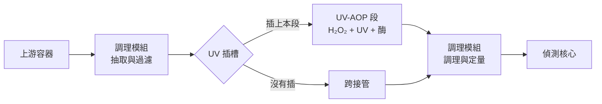
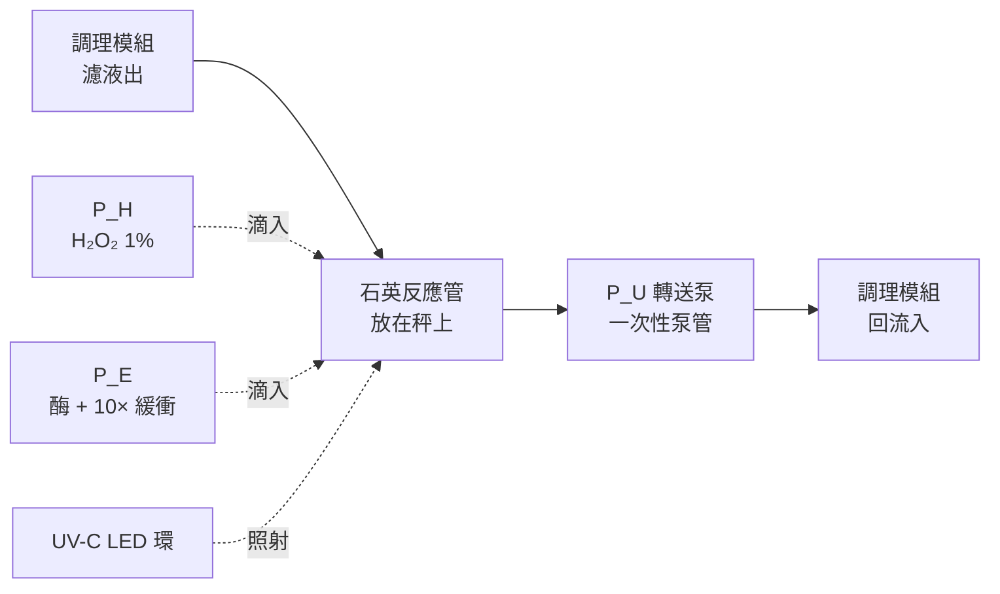
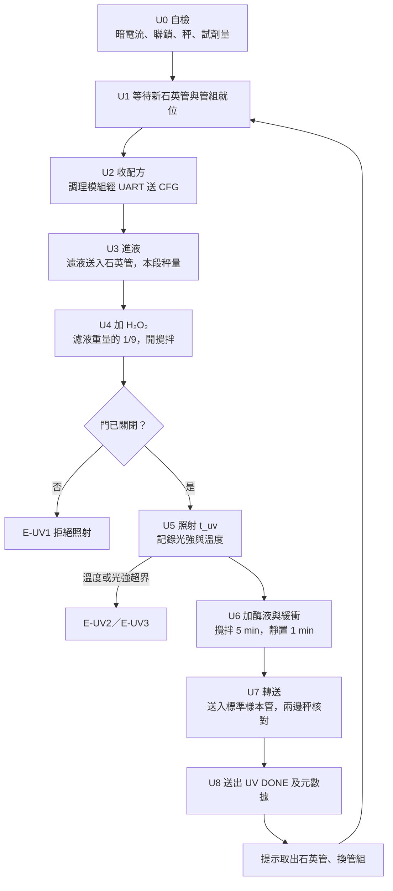

# UV-AOP 氧化模組：硬件計劃書

標準調理模組內的可選插入段：泥土路線 2、日後的海鮮模組、水樣總汞模式共用

## 1　摘要與目標

現有的泥土 NaCl 模組（路線 1）只量到「容易被釋出的那一部分汞」。有兩種汞它看不到：**黏得比較緊的無機汞**，以及**有機汞（主要是甲基汞）**。後者正好是毒性最高、最會沿食物鏈累積的形態。

這個模組補上這個空位。它分兩步：先用 L-半胱氨酸把包括有機汞在內的汞從泥土拉出來，再用 UV 加稀 H₂O₂ 把所有汞轉成感測器讀得到的 Hg²⁺。

| 目標 | 量化指標 |
| --- | --- |
| 覆蓋有機汞 | 甲基汞標準品經處理後，以 Hg²⁺ 形式回收 ≥ 80%（由合作實驗室驗證） |
| 輸出可直接上感測器 | 殘餘 H₂O₂ 低於試紙最低刻度；殘餘半胱氨酸不足以錯合汞 |
| pH 在範圍內 | 經調理模組後 pH 落在感測器校準範圍，誤差 ≤ 0.3 |
| 全自動 | 使用者只多做一件事：每次換一支已清洗的石英管 |
| 可共用 | 插入標準調理模組的插槽即用（見第 4 節） |

**最重要的設計決定**：這個 UV 段不寫死在任何萃取模組裡，而是做成標準調理模組裡的一個**可選插入段**，位置在過濾之後、加緩衝之前。泥土路線 2、將來的海鮮模組（魚肉裡大部分是甲基汞），以及想量水樣溶解態總汞時，都只是把這一段插上去，不用重做。

## 2　為何需要 UV 階段

要解釋硬件為何要多一個 UV 反應器，先要說清楚兩個約束。

### 2.1　感測器只讀得到一種汞

汞生物感測器靠的是細菌內的汞調控蛋白（MerR 家族），它結合的是**自由的 Hg(II)**。甲基汞分子裡的汞被一條碳–汞鍵鎖住，標準感測器對它的反應遠低於對 Hg²⁺的反應。所以如果不先把有機汞轉成無機汞，就算成功萃取出來，讀數依然會偏低。

### 2.2　把汞拉出來的試劑，會把汞藏起來

L-半胱氨酸是一種含硫氨基酸，它對汞的親和力極高（我們乾實驗用的硫醇錯合常數 log β₂ 約 40）。正因為如此它才能把黏得緊的汞從泥土顆粒上拉下來。但同一個原因令它成為下一步的障礙：被半胱氨酸抓緊的汞，感測器一樣拿不到。

所以萃取液裡的汞有兩層「鎖」：有機汞的碳–汞鍵，以及半胱氨酸的硫醇錯合。UV 加 H₂O₂ 是環境分析裡標準的做法，用來同時解決這兩層：紫外光把過氧化氫打斷成活性物種，把有機分子氧化分解，汞就釋放成自由的 Hg²⁺。

### 2.3　對硬件的具體要求

上面兩點直接譯成六個設計條件：

1. **UV 要在過濾之後**。懸浮顆粒會散射和遮擋紫外光，而且泥土有機質會先把 H₂O₂ 消耗掉。所以 UV 段接在濾膜後，不是放在反應杯裡。
2. **光程要短**。溶液對 254 nm 有吸收，光強迅速衰減。反應器要做成薄層或細管，不能是一大杯。
3. **要透 UV 的材料**。普通玻璃、PETG、矽膠都會擋住或被 UV 打壞，受照部分必須用石英（或薄 PTFE）。
4. **要多一個試劑瓶和一個加液位**。H₂O₂ 要在照射前加，其量要準。
5. **輸出前要除掉殘餘 H₂O₂**。感測器是活細菌，過氧化氫會殺死它。這是整個設計最容易被忽略、但一失敗就全軍覆沒的一步。
6. **UV-C 要完全封閉**。254–280 nm 對眼和皮膚有害，外殼要不透光加門開關聯鎖。

## 3　設計依據與規格

路線 2 的萃取由泥土模組完成（把 P1 的試劑瓶換成半胱氨酸儲備液），過濾由標準調理模組負責，本段處理的是調理模組送來的濾液。**所有化學參數都是佔位值**，等乾實驗與文獻整理定案；硬件只要支持得到整個範圍就夠。

| 項目 | 設定 | 備註 |
| --- | --- | --- |
| 萃取（在泥土模組） | L-半胱氨酸，10× 儲備液由 P1 加入 | 佔位最終 50 mM；支援 10–100 mM |
| 萃取液 pH | 配液時調好 | 佔位微酸；由乾實驗定 |
| 液固比、攪拌 | 10 mL/g、600 rpm | 與路線 1 相同 |
| 萃取時間 | 預設 60 min，5–120 min 可設 | 半胱氨酸萃取通常比 NaCl 慢 |
| 過濾 | 2 µm → 0.45 µm | 由標準調理模組負責 |
| 進入本段的濾液 | 約 8.5 g | 由調理模組按配方決定，本段的秤量出 |
| H₂O₂ 儲備液 | 1%（約 0.3 M），預先稀釋 | 琥珀色瓶，冷藏，每兩週更換 |
| H₂O₂ 最終濃度 | 佔位 0.1%；支援 0.05–0.2% | 加入量為濾液重量的 1/9；更高濃度要改用較濃的儲備液 |
| UV 波長 | 265–280 nm UV-C LED | 見下方說明 |
| 照射時間 | 預設 20 min，5–60 min 可設 | 實際劑量以光強 × 時間記錄 |
| 除殘餘 | 過氧化氫酶，溶於 10× 緩衝 | 加入量為最終標準樣本重量的 1/10，見 5.4 |
| 本段稀釋倍數 | 約 1.25 | 以轉送前實測的總重量計算，寫入元數據 |
| 溫度 | 記錄；照射時監察上限 | 見 5.1 |

**為何用 UV-C LED 而不用低壓汞燈**：環境分析裡的標準 UV 源是 254 nm 低壓汞燈，但這種燈管內部就是汞。在一部量汞的儀器裡放一支汞燈，一旦破裂就是污染加安全事故，而且永遠無法向評審解釋清楚。UV-C LED 波長稍長、功率稍低，但對約 10 mL 足夠，而且即開即亮、不用預熱、壽命長、不含汞。這是我認為不應該妥協的一點。

## 4　插入位置與模組關係

### 4.1　為何放在調理模組裡面，而且在這個位置

- **在過濾之後**：UV 需要清澈的液體（見 2.3）。
- **在加緩衝之前**：有機緩衝劑會消耗 UV/H₂O₂ 產生的自由基，自己也會被氧化。所以次序是先過濾、再照射；緩衝在照射之後才由本段的酶液帶入（見 5.4），最後由調理模組補 NaCl 和水。
- **不必每個萃取模組各有一套**：路線 2、海鮮、水樣總汞模式都插同一段。

之前的版本把本段設計成接在萃取模組與偵測核心之間的獨立後處理段。現在標準調理模組是所有樣本的必經之路，本段自然變成它內部的插入段：共用的好處不變，而過濾、調理、定量都不用再做一次。

### 4.2　實際要新做的部分比想像中少

路線 2 的萃取段和路線 1 的硬件完全一樣：泥土模組只是換試劑瓶、延長萃取時間。過濾和調理由調理模組負責。所以這份計劃書真正要新做的，只有 UV 段本身：石英反應管與 LED、兩個試劑泵、一個轉送泵、一個秤和安全外殼。

### 4.3　實體插槽

調理模組上有兩個 Luer 口（「濾液出」、「回流入」）和一個 UART 與在位偵測接頭（本段自備 12 V 電源，不由調理模組供電）。本段插上後，濾液由「濾液出」進入石英管，處理完由本段的轉送泵經「回流入」送進標準樣本管。沒有插時，用一條短跨接管把兩個口連通。韌體經 UART 自動偵測本段是否存在，調理模組據此改用對應配方。

## 5　子系統設計

實線是樣本路徑，虛線是試劑和光。設計沿用標準調理模組的兩條原則：**接觸樣本的部件每次整套更換**；**試劑滴嘴懸在液面上方，永不接觸樣本**。

上一版用一支注射器加五個三通旋塞，樣本和試劑都經同一條路抽推，所以每次要用緩衝液沖洗管路，還要一個含汞的廢液瓶。這和泥土模組放棄注射泵是同一個原因：殘留沖不乾淨。改成蠕動泵加每次更換的石英管之後，這段**沒有閥、沒有沖洗步驟，也沒有廢液瓶**。

### 5.1　UV 反應器

- **反應管**：石英試管（外徑 16 mm，壁厚 1 mm），照射時約 9.5 mL，液深約 60 mm。石英在 254–280 nm 透光率高，普通玻璃幾乎全擋。
- **每次更換，不在機上清洗**：石英管是唯一既接觸樣本、又不能拋棄的部件。準備三支輪流：一支在用、一支待清洗、一支已清洗備用；每支連同自己的攪拌子一起清洗，方法由導師定（見 7.4）。這樣機上就不需要沖洗液和廢液瓶，殘留問題變成「這支管有沒有洗乾淨」，可以用空白模式逐支核對。
- **放在秤上**：石英管插在管座內，管座裝在 100 g 稱重感測器上，用來計量濾液、H₂O₂ 和酶液，並核對轉送量。LED 環、風扇、遮光罩和管口蓋板都固定在外殼上，不接觸石英管，以免散熱、震動和接線干擾稱重。伸入液中的吸液管會令讀數多約 1%（排開液體的浮力），這是固定比例，校準時一併扣除。
- **攪拌**：管底放一顆 PTFE 包覆的小攪拌子，下方是小型磁力攪拌器（約 300 rpm）。攪拌有三個作用：把 H₂O₂ 拌勻、令每一部分液體都輪流經過受照範圍、避免管壁局部過熱。有了攪拌，就不必為了縮短光程而做複雜的薄層流池。秤重前先停攪拌並等讀數穩定；加液以前後差值計算，所以磁鐵對攪拌子的固定吸力會互相抵消。
- **光源**：6 顆 265–280 nm UV-C LED，均勻分布在管四周，對準液面中段。以恆流驅動，因為 UV-C LED 的輸出隨溫度和電流變化很大。
- **散熱**：LED 裝在鋁散熱環上，外加小風扇。UV-C LED 電光轉換效率只有幾個百分點，其餘全部變成熱；6 顆 LED 共耗電約 2–4 W，在封閉外殼裡必須導走。
- **光強監測**：一顆 UV 光電二極管對著石英管，每秒記錄讀數。沒有它就無法講「劑量」：只知道燈開了多久，不知道實際照到多少。有了它，每次運行可以輸出一個「相對劑量」數字，也能及早發現 LED 老化或石英管沒洗乾淨。
- **溫度**：散熱環上裝 DS18B20；樣本溫度用非接觸紅外溫度計對準 LED 環上方的管壁量度。石英管放在秤上，任何貼在管壁的感測器都會干擾稱重，所以用非接觸式。

### 5.2　試劑、轉送與計量

- **P\_H：H₂O₂**。用 1% 稀釋儲備液，加入量為濾液重量的 1/9，令照射液中 H₂O₂ 為 0.1%（佔位值）。用稀液而不用濃液有兩個原因：一是學生不應該處理高濃度過氧化氫；二是每次加的量大一點，定量誤差就小很多。
- **H₂O₂ 儲存**：琥珀色 PP 瓶，避光、冷藏，瓶蓋留排氣孔。H₂O₂ 會自行分解，所以儲備液寫明配製日期，每兩週重配，並用試紙核對濃度。
- **P\_E：酶液**。過氧化氫酶溶於平台共用的 10× 緩衝，加入量為最終標準樣本重量的 1/10，由調理模組在配方裡告知本段。為何這樣配見 5.4。酶液冷藏，按 wet lab 建議定期重配，配製日期寫入元數據。
- **P\_U：轉送泵**。由石英管底部的 PTFE 吸液管抽液，經「回流入」送進調理模組上的標準樣本管。吸液管和泵管段屬一次性管組：插上本段時改用「UV 版」管組，即在調理模組的管組上多接這一小段，使用者仍然只換一套。
- **計量方式**：全部以重量計，與泥土模組和調理模組一樣：先快速泵到目標的 90%，再以短脈衝逼近，每次脈衝後等秤讀數穩定。泵管老化只會令流量漂移，秤重閉環會自動補償。
- **轉送核對**：本段的秤量出送走多少，調理模組的秤量出收到多少，兩者相差超過容許值即判為漏液（E-UV5）。這和泥土模組用秤核對抽取量是同一個做法。
- **乾淨試劑管路**：P\_H、P\_E 只接觸乾淨試劑，泵管定期更換即可；1% H₂O₂ 對矽膠泵管影響很小。每日第一次運行前各泵約 0.5 mL 到預充管，排走氣泡並確認有出液。

### 5.3　流路與材料

UV 會打壞很多塑料，所以材料要分區看：

| 位置 | 材料 | 原因 |
| --- | --- | --- |
| 受照的反應管 | 石英 | 唯一透 UV 又耐 UV 的選擇 |
| 伸入管內的吸液管 | PTFE | 耐 UV，不吸附汞；屬一次性管組 |
| 攪拌子 | PTFE 包覆 | 隨石英管一起輪換和清洗 |
| 管口蓋板 | PTFE | 會受到散射光；固定在外殼上，不接觸石英管 |
| P\_U 泵管段 | 矽膠或其他泵管 | 不受照；每次換新，吸附變成固定、可校準的損失 |
| P\_H、P\_E 泵管 | 矽膠 | 只接觸乾淨試劑 |
| LED 散熱環 | 鋁 | 散熱；不放在秤上 |
| 外殼與支架 | PETG 打印 | 不可受照，見下 |

重點：**矽膠和 PETG 不可以出現在受照區**。兩者都會被 UV-C 逐步分解，碎屑會落入樣本，而且老化後會漏。打印件只用來做外殼和支架，且要被 LED 的遮光罩擋住。

### 5.4　殘餘 H₂O₂ 與殘餘半胱氨酸

這是整個模組最關鍵的一步。輸出要送給活細菌，而過氧化氫會殺菌；如果這一步做不好，整條路線就用不成。

- **第一道關：UV 本身**。照射會持續消耗 H₂O₂，照足時間後大部分已經分解。但我們不應該只靠這一點，因為剩多少跟樣本有多少有機質有關，每個樣本都不同。
- **第二道關：過氧化氫酶**。照射完畢後由 P\_E 加入酶液，讓它把剩餘的 H₂O₂ 分解成水和氧氣。酶對汞的讀數沒有影響，也不會像硫代硫酸鈉那樣把汞錯合走。
- **酶為何溶在 10× 緩衝裡**：氧化後半胱氨酸會變成磺酸，溶液變酸，而過氧化氫酶在中性附近才最有效。同一步加酶加緩衝，pH 在酶開始工作的一刻就被拉回中性。緩衝本來就必須在 UV 之後才加（見 4.1），合併之後省回一個泵和一個步驟，調理模組也只需再補 NaCl 和水。
- **進階做法**：把酶固定在小管柱上，液體流過即可，省回一個試劑瓶和一個泵（緩衝則改由調理模組的 P\_B 加）。這正好是 wet lab 可以貢獻給硬件的位置。第一版先用液體酶，因為簡單且買到就用到。
- **殘餘半胱氨酸**：氧化後的半胱氨酸不再抓得住汞，但「照多久才夠」要實測。驗證方法見 9.2，是一個純水溶液實驗，不需要泥土。

### 5.5　控制電子

| 部件 | 用途 |
| --- | --- |
| ESP32 | 狀態機、與調理模組的 UART、記錄 |
| 3 個 12 V 蠕動泵 | P\_H、P\_E、P\_U |
| MOSFET 模組 × 3 | 驅動三個泵 |
| HX711 + 100 g 稱重感測器 | 計量與轉送核對 |
| UV-C LED 恆流驅動 | 6 顆 LED，可 PWM 調光 |
| 硬件聯鎖開關 | 串在 LED 驅動供電上，門一開即斷電 |
| UV 光電二極管 | 實測光強、算劑量 |
| DS18B20 + 非接觸紅外溫度計 | 散熱環溫度、管壁溫度 |
| 小風扇 | LED 散熱 |
| 小型磁力攪拌器 | 反應管內攪拌 |
| 微動開關 | 石英管到位偵測 |
| 「UV 開」指示燈 | 照射時亮起 |
| 12 V 3 A 電源 + 5 V 降壓 | 本段自備，不由調理模組供電 |

## 6　自動化流程與控制邏輯

### 6.1　幾個要點

- **本段只跟調理模組對話**：它是調理模組的一部分，經插槽的 UART 收配方、回報狀態。對主機來說，平台上仍然只有一個調理模組，所以以後加其他插入段（例如預濃縮），主機的協議也不用改。
- **U2 收配方**：調理模組按上游回報的基質代碼選配方，把目標濾液重量、H₂O₂ 比例、照射時間和最終標準樣本重量送給本段。
- **U3 進液**：濾液由調理模組的 P\_S 經「濾液出」送入石英管，由本段的秤量出重量，到目標即通知調理模組停泵。
- **U5 照射**：每秒記錄光電二極管讀數，累積值就是這次運行的相對劑量。光強降到基準的一半以下，視為 LED 老化或石英管沒洗乾淨，提示檢查。管壁溫度超過上限即停照射、等冷卻再續，暫停時間記入元數據。
- **U6 除殘餘**：加酶液後攪拌 5 min（佔位），讓酶分解剩餘 H₂O₂、令 pH 回到中性；再靜置 1 min，讓氧氣泡浮走才轉送。
- **U7 轉送**：石英管內總會留下少量液體。因為液體已攪勻，送走的比例由重量算出；調理模組按實際收到的緩衝量決定最終重量，令緩衝仍然是 1×，再補 NaCl 和水。
- **U8 元數據**：本段稀釋倍數、相對劑量、照射與暫停時間、最高溫度、H₂O₂ 與酶液配製日期、石英管編號。稀釋倍數以轉送前實測的總重量除以濾液重量計算，所以照射時蒸發掉的水也會自動計入。總稀釋倍數由調理模組把各段相乘得出。
- **沒有清洗步驟**：石英管和樣本管路每次更換，試劑管路從未接觸樣本。萬一空白偏高，可以憑石英管編號追查是哪一支。

### 6.2　錯誤代碼

| 代碼 | 情況 | 處理 |
| --- | --- | --- |
| E-UV1 | 門未關或聯鎖失效 | 不進入照射，提示關門 |
| E-UV2 | 管壁或散熱環溫度超界 | 停照射；冷卻後重試一次，再超則停機 |
| E-UV3 | 光強低於基準一半 | 完成本次但標記「劑量不足」，提示檢查 LED 與石英管 |
| E-UV4 | 試劑不足，或石英管、管組未就位 | 開始前拒絕運行 |
| E-UV5 | 轉送量兩邊秤核對不符 | 標記樣本無效，提示檢查漏液 |
| E-UV6 | 加液超時或超量 | 標記樣本無效 |

### 6.3　特別模式

- **空白模式**：用去離子水當樣本跑全流程，檢查石英管和管路的汞殘留。每批先跑一次；空白偏高時按石英管編號追查。
- **旁路模式**：插上本段但不照射、不加 H₂O₂，酶液與緩衝照加，令兩組的基質完全相同。用途有二：對水樣或路線 1 萃取液，同一個樣本「照射」與「不照射」的差異，就是有機汞（及被溶解有機物抓住的汞）那一部分；對路線 2 萃取液，不照射時讀數應該很低，這就是 W1 的「遮蔽」現象在真實樣本上重現。兩者經過同一款石英管、管路和稀釋，差異只來自 UV，這是整個模組最有說服力的實驗，建議寫進 Wiki。
- **手動與校準模式**：用已知重量砝碼校秤；以水校準吸液管排液造成的固定比例；各泵以重量法校正每秒流量（只用於加速逼近，最終以秤為準）；記錄 LED 基準光強。

## 7　安全設計

這段比泥土模組多兩個危險源：紫外光和氧化劑。兩樣都有成熟的處理方法，但要寫進設計，不是靠使用者記得。

### 7.1　UV-C

- **完全封閉**：不透光外殼，不開觀察窗。要看裡面就停機開蓋。
- **硬件聯鎖**：門上裝微動或磁簧開關，**串在 LED 驅動的供電線上**，不是只做軟件判斷。韌體再加一重檢查，兩重都要。
- **不自動重啟**：門重新關上之後要按鍵才繼續，不會自己亮回。
- **標誌**：外殼貼 UV 警告標籤，照射時外殼上的「UV 開」指示燈亮起，調理模組的 OLED 同時顯示狀態。
- **臭氧**：185 nm 以下的短波會產生臭氧，265–280 nm LED 基本上不會。這是選 LED 的另一個好處，但仍然保持室內通風。
- **一句要記住**：UV-C 對眼角膜的傷害是幾個小時後才發作的，當下沒感覺不代表安全，所以永遠不要「只看一眼」。

### 7.2　過氧化氫

- 模組只用 **1% 稀釋液**。高濃度過氧化氫有腐蝕性，學生不應該自行處理；如果要由較濃的商品稀釋，由導師做。
- 琥珀色瓶、避熱，瓶蓋留排氣孔（分解會放出氧氣，密封會積壓）。
- 不要與有機溶劑、金屬粉末或強還原劑放在一起。
- 操作時戴手套和護目鏡；濺到皮膚或眼睛即大量水沖。

### 7.3　L-半胱氨酸

本身毒性低（是常見的食品補充劑成分），但溶液會在空氣中氧化變質，所以要新鮮配製、寫明日期，並在測試記錄裡帶上配製時間。有硫味是正常的。

### 7.4　汞

- 本段不儲存汞試劑；兩瓶試劑都不含汞。
- **機上沒有廢液瓶**：樣本只會留在一次性管組和石英管裡。用過的管組按實驗室汞廢物規定棄置。
- **石英管的清洗液含汞**，要收集、標示，按汞廢物處理。清洗由導師或在導師監督下進行，地點和方法由導師定，並在 SOP 裡寫清楚。

### 7.5　電氣

12 V 低壓；液體區與電子區分開，電子區在上方並有防濺蓋；LED 驅動的散熱塊不要裸露。

## 8　物料清單與成本估算

港幣粗估，落單前要報價。萃取由泥土模組、過濾和調理由標準調理模組負責，這裡只計 UV 段本身的零件。

| 類別 | 項目 | 數量 | 估計（HK$） | 備註 |
| --- | --- | --- | --- | --- |
| 控制 | ESP32 開發板 | 1 | 40 |  |
| 泵 | 12 V 蠕動泵 | 3 | 120–240 | P\_H、P\_E、P\_U |
| 驅動 | MOSFET 模組 | 3 | 30 |  |
| 稱重 | 100 g 荷重元 + HX711 | 1 | 30 |  |
| UV 光源 | 265–280 nm UV-C LED | 8 | 200–450 | 6 用 2 備；主要成本 |
| UV 驅動 | 恆流驅動模組（可 PWM） | 1 | 30–60 |  |
| 反應管 | 石英試管 16 mm | 3 | 150–375 | 1 用 1 洗 1 備 |
| 光測 | UV 光電二極管（UVC 感光） | 1 | 40–100 | 算劑量用 |
| 散熱 | 鋁散熱環 + 30 mm 風扇 | 1 套 | 40–60 |  |
| 攪拌 | 小型磁力攪拌器 + PTFE 攪拌子 | 1 + 3 | 50–90 | 攪拌子隨石英管輪換 |
| 安全 | 微動或磁簧聯鎖開關 | 2 | 15 | 串在供電線 |
| 感測 | DS18B20、非接觸紅外溫度計、微動開關 | 各 1 | 60–100 |  |
| 一次性管組 | PTFE 吸液管、泵管段、Luer 接頭 | 30 套 | 90–180 | 每套約 HK$3–6 |
| 管口蓋板 | PTFE 板或塞 | 2 | 40–80 | 鑽孔後用 |
| 儲液 | 琥珀色瓶、試劑瓶 | 2 | 20 |  |
| 試劑 | L-半胱氨酸 | 100 g | 50–150 |  |
| 試劑 | 過氧化氫酶（catalase） | 1 | 100–200 | 或由 wet lab 自製 |
| 試劑 | 3% 過氧化氫（藥房級） | 1 瓶 | 20 | 再稀釋至 1% |
| 耗材 | H₂O₂ 測試試紙 | 1 盒 | 40–80 | 驗證輸出無殘餘 |
| 電源 | 12 V 3 A + 5 V 降壓 | 1 套 | 60 | 本段自備 |
| 結構 | PETG 線材、不透光外殼材料 | — | 80–120 |  |
| 雜項 | 螺絲、線材、連接器、指示燈 | — | 50–100 |  |
| **合計** |  |  | **約 1,355–2,600** |  |

兩樣東西拉開了整個範圍：UV-C LED 和石英管。兩者都不建議省：用便宜而波長不明的 LED，就算有光電二極管也說不清自己照了什麼；用玻璃替石英則基本上等於不照。其餘零件可以挑便宜的。與上一版相比，少了注射泵、五個伺服旋塞和廢液瓶，多了三個蠕動泵、一個秤和第三支石英管，總價相若；但每次運行多了一小段一次性管組（約 HK$3–6）的耗材開支。

## 9　測試與驗證計劃

分三層。前兩層不需要泥土，第二層甚至已經足以證明整個模組的核心主張。

### 9.1　無汞硬件測試

| 測試 | 方法 | 合格標準 |
| --- | --- | --- |
| V1 加液準確度 | 吸液管就位，P\_H、P\_E 各加 10 次，以天平複秤 | 誤差 ≤ 2%，CV ≤ 1% |
| V2 石英管更換 | 計時；同一支管放上取下 10 次 | 每次 ≤ 1 min；到位偵測 10/10；無漏液 |
| V3 聯鎖 | 照射中開門 20 次，用光電二極管確認燈有否熄滅 | 20/20 即時斷電 |
| V4 光強基準 | 開機後 10 min 記錄，建立基準曲線 | 穩定後波動 ≤ 5% |
| V5 溫升 | 9.5 mL 水照射 60 min，記錄管壁與散熱環溫度 | 由此訂出溫度上限 |
| V6 AOP 有效性 | 染料褪色測試：已知濃度色素 + H₂O₂ + UV，量褪色程度 | 在預設劑量下褪色程度可重複，CV ≤ 10% |
| V7 殘餘 H₂O₂ | 輸出液用試紙 | 低於試紙最低刻度 |
| V8 轉送 | 轉送後秤石英管內剩餘液體；比較兩邊秤 | 剩餘量穩定（CV ≤ 10%）；兩邊相差 ≤ 2% |
| V9 樣本之間殘留 | 高濃度色素跑一次，換清洗過的石英管和新管組後跑空白 | 空白無可測色素 |
| V10 連續運行 | 10 次完整流程 | 無漏液、無未處理錯誤 |

V6 的染料褪色測試值得說明：我們無法直接看到「有機汞有沒有被打斷」，但可以用一個看得見的反應作為代理指標。色素在 UV/H₂O₂ 下會褪色，褪色程度就是這次照射的實際效果。這給我們一個便宜、天天做得到的日常檢查，也是 LED 老化的指示器。

### 9.2　水溶液汞測試（不需要泥土）

這組實驗是整個模組最有價值的部分：全部用稀釋汞標準溶液，在學校實驗室有導師監督下就做得到。

| 實驗 | 做法 | 預期 |
| --- | --- | --- |
| W1 先證明問題存在 | 已知濃度 Hg²⁺ 溶液，加入半胱氨酸後讀數 | 讀數大幅下降 |
| W2 再證明 UV 解決了 | 同一溶液經模組的 UV + H₂O₂ + 酶 | 讀數回升至接近原本 |
| W3 試劑本身無干擾 | 只加酶液與緩衝，不加半胱氨酸 | 讀數與對照一致 |
| W4 定出照射時間 | W2 在 5、10、20、40 min 各做一次；含 NaCl 與不含 NaCl 的基質各一組 | 曲線跑平的點即 t\_uv；兩種基質如有差別，分開設定 |
| W5 有機汞（如有條件） | 以甲基汞標準品重複 W2 | 轉化率 ≥ 80% |

W1 加 W2 合起來就是一個完整的故事：先讓人看到「抓緊了的汞感測器看不到」，再看到「UV 之後又看到了」。不需要泥土、不需要 ICP-MS，卻直接證明了這個模組存在的理由。W5 要看導師評估能否在校內處理甲基汞標準品；如果不行，歸到 9.3。

### 9.3　合作實驗室

- 甲基汞標準品經模組處理後，以 CVAAS 或 ICP-MS 核對總汞回收。
- 加標泥土跑全流程，與標準方法對比。
- 材料吸附與清洗：石英管、PTFE 吸液管、泵管段在含 Hg(II) 溶液中浸泡前後比較；石英管按導師定的方法清洗後再量一次殘留，驗證清洗方法。
- 路線 1 與路線 2 對同一泥土的結果差異（這個差異本身就是一個有意思的數據）。

## 10　風險、限制與待決事項

### 10.1　技術風險

| 風險 | 影響 | 緩解 |
| --- | --- | --- |
| 氣泡 | 氧化和酶反應都會放出氧氣，氣泡遮光、干擾轉送 | 管頂留頂空；吸液管在底部；加酶後靜置 1 min 再轉送；攪拌有助排氣 |
| 殘餘 H₂O₂ 殺死感測器 | 讀數全錯，而且會誤以為沒汞 | UV + 酶雙重保險；試紙核對；每批跑空白 |
| UV 劑量不足 | 有機汞轉化不完全，結果偏低 | 光電二極管算劑量；旁路模式對照；照射時間可調 |
| 氯離子消耗自由基 | 含 NaCl 的濾液（路線 1、海鮮）轉化可能較慢 | W4 在兩種基質各做一組，照射時間按基質分開設定 |
| 石英管沒洗乾淨 | 樣本之間殘留；積垢令透光下降 | 清洗方法由導師定；石英管編號寫入元數據；每批空白；光強監測會先發現積垢 |
| LED 老化 | 劑量慢慢變少 | 基準光強記錄 + 染料褪色日常檢查 |
| 溫升與蒸發 | 水分減少，濃度偏高 | 散熱 + 風扇；管口蓋板減少蒸發；稀釋倍數以實測重量計算，蒸發會自動計入 |
| 酶液失效 | 殘餘 H₂O₂ 未除盡 | 冷藏、定期重配；每批空白與試紙核對 |
| 半胱氨酸溶液氧化 | 萃取效率下降，批次之間不一致 | 新鮮配製；記錄配製時間；小瓶裝 |
| 汞吸附在石英或管路 | 結果偏低 | 9.3 吸附測試；管路每次換新，損失變成固定值 |
| 石英管破裂 | 漏液、割傷 | 管座有軟墊；有備用管；碎片按含汞玻璃處理 |

### 10.2　科學與測量限制

- **仍然不是「總汞」**。這條路線量到的是「半胱氨酸可萃取，經氧化後變成 Hg²⁺ 的那部分」。被包在礦物晶格裡的汞依然不會出來，也不應該出來——那部分在環境裡本來就不活躍。要真正的總汞，得用強酸消解，那不是學生實驗室做的事。寫報告時要用「半胱氨酸可萃取總汞」這類說法。
- **路線 1 與路線 2 回答不同問題**。路線 1 答「現在有多少汞容易被植物拿到或流走」，路線 2 答「這塊地究竟積了多少有害的汞」。兩者不是改良關係，是兩個指標，最好一起報。
- **校準曲線可能仍要分開**。經調理模組後，氯離子、緩衝和 pH 已與路線 1 相同，但輸出液仍含氧化後的半胱氨酸產物和少量酶。這些殘餘物會否影響感測器要實測（做法同調理模組計劃書的 Y3）；如有影響，路線 2 要有自己的校準曲線。
- **稀釋**：本段加上調理段，總稀釋約 1.4 倍，偵測下限效果上提高同樣倍數。
- **UV 不會變出汞**。值得在 Wiki 寫一句：UV 只是把已經存在的汞從被鎖住的形態釋放出來，總量不變。

### 10.3　待決事項

- [ ] L-半胱氨酸濃度、pH、萃取時間（等乾實驗與文獻）
- [ ] H₂O₂ 最終濃度與照射時間（等 W4）
- [ ] 酶的用量與來源：購買或由 wet lab 表達
- [ ] 緩衝液配方（與標準調理模組共用同一種 10× 緩衝）
- [ ] 石英管尺寸與 LED 排布，要先買到貨才能定 CAD
- [ ] 石英管清洗方法（由導師定）
- [ ] 在校內處理甲基汞標準品是否可行（導師決定；W5 取決於此）
- [ ] iGEM 期間做到哪一步：只做到 9.2，還是連 9.3 一起做

## 11　時間表

本段是可選項目：iGEM 期間的主線是標準調理模組加泥土模組（路線 1），本段要看階段 0 的結果再決定做不做。下表以週數計，從決定開展起計。最重要的排序判斷：**9.2 的水溶液實驗不用等硬件**。只要 wet lab 有汞標準溶液、半胱氨酸和一盞 UV 燈，第一週就可以開始做 W1–W2。如果 W2 做不出來，整條路線的前提就有問題，不值得先花錢買 UV-C LED。

| 階段 | 週數 | 工作 | 交付物 |
| --- | --- | --- | --- |
| 0 概念驗證 | 第 1–2 週 | wet lab 做 W1–W2（手動，任何 UV 源都可以） | 「半胱氨酸遮蔽 → UV 恢復」的數據 |
| 1 定稿與訂貨 | 第 2 週 | 報價訂 LED、石英管（交貨最慢） | 訂單 |
| 2 CAD 與打印 | 第 2–3 週 | 外殼、LED 環、秤上管座、管口蓋板、插槽接口 | CAD 檔、打印件 |
| 3 電子與韌體 | 第 3–5 週 | 三個泵、秤、LED 驅動、聯鎖、狀態機、與調理模組的 UART | 可運行的韌體 |
| 4 無汞測試 | 第 5–7 週 | V1–V10；先做 V3 聯鎖 | 測試紀錄、v1.1 設計 |
| 5 上機驗證 | 第 7–8 週 | 插上調理模組，用水溶液重做 W2–W4，定出 t\_uv | 自動化版的 W 組數據 |
| 6 整合 | 第 8–9 週 | 泥土模組（路線 2）→ 調理模組 + 本段 → 偵測核心，跑完整流程 | 整合示範 |
| 7 合作實驗室 | 第 9 週或以後 | 9.3 | 回收率數據 |
| 8 文件 | 貫穿全程 | 裝配指南、SOP（含 UV 安全與石英管清洗）、Wiki | 開源檔案 |

關鍵路徑是 UV-C LED 和石英管到貨。另一個依賴是：本段要插在一部已經跑得動的調理模組上，所以階段 5 要排在調理模組的端到端 demo 之後。如果時間不夠，最小可交付是階段 0 加階段 4：有一個證明概念成立的水溶液實驗，加一部經無汞測試驗證的機，已經足夠在 Wiki 上完整交代這個模組。
