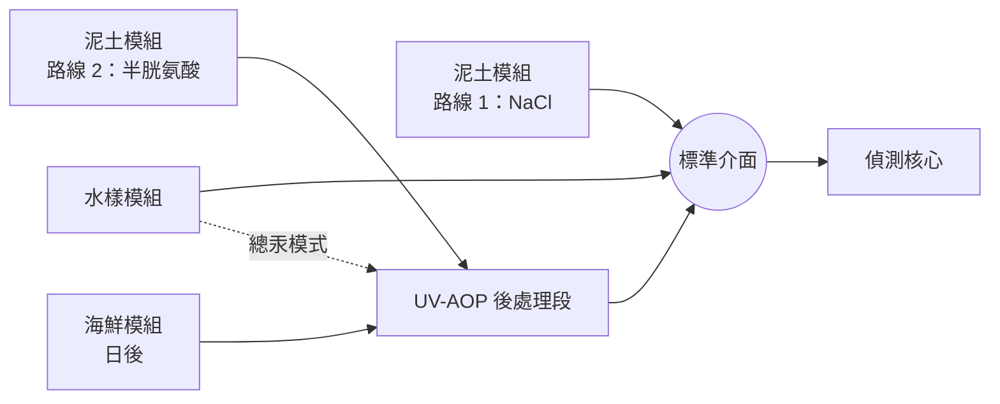
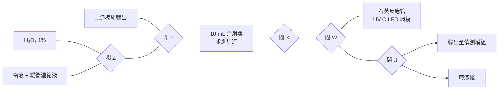
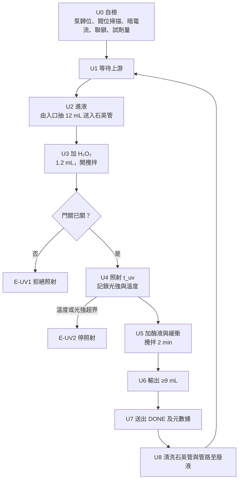

# UV-AOP 氧化模組：硬件計劃書

泥土路線 2（L-半胱氨酸 → UV/H₂O₂），兼做平台的通用氧化前處理段

## 1　摘要與目標

現有的泥土 NaCl 模組（路線 1）只量到「容易被釋出的那一部分汞」。有兩種汞它看不到：**黏得比較緊的無機汞**，以及**有機汞（主要是甲基汞）**。後者正好是毒性最高、最會沿食物鏈累積的形態。

這個模組補上這個空位。它分兩步：先用 L-半胱氨酸把包括有機汞在內的汞從泥土拉出來，再用 UV 加稀 H₂O₂ 把所有汞轉成感測器讀得到的 Hg²⁺。

| 目標 | 量化指標 |
| --- | --- |
| 覆蓋有機汞 | 甲基汞標準品經模組處理後，以 Hg²⁺ 形式回收 ≥ 80%（由合作實驗室驗證） |
| 輸出可直接上感測器 | 殘餘 H₂O₂ 低於試紙最低刻度；殘餘半胱氨酸不足以錯合汞 |
| pH 在範圍內 | 輸出 pH 落在感測器校準所用的範圍，誤差 ≤ 0.3 |
| 全自動 | 使用者只做兩個動作：放入泥土杯、完成後取走杯及換濾膜 |
| 可共用 | UV 段可獨立接在其他模組之後（見第 4 節） |

**最重要的設計決定**：這個 UV 段不寫死在泥土模組裡，而是做成一個獨立、可以插在任何萃取模組與偵測核心之間的**後處理段**。將來的海鮮模組面對的正是同一個問題（魚肉裡大部分是甲基汞），它可以直接沿用這個段，不用重做。

## 2　為何需要 UV 階段

要解釋硬件為何要多一個 UV 反應器，先要說清楚兩個約束。

### 2.1　感測器只讀得到一種汞

汞生物感測器靠的是細菌內的汞調控蛋白（MerR 家族），它結合的是**自由的 Hg(II)**。甲基汞分子裡的汞被一條碳–汞鍵鎖住，標準感測器對它的反應遠低於對 Hg²⁺的反應。所以如果不先把有機汞轉成無機汞，就算成功萃取出來，讀數依然會偏低。

### 2.2　把汞拉出來的試劑，會把汞藏起來

L-半胱氨酸是一種含硫氨基酸，它對汞的親和力極高（我們乾實驗用的硫醇錯合常數 log β₂ 約 40）。正因為如此它才能把黏得緊的汞從泥土顆粒上拉下來。但同一個原因令它成為下一步的障礙：被半胱氨酸抓緊的汞，感測器一樣拿不到。

所以萃取液裡的汞有兩層「鎖」：有機汞的碳–汞鍵，以及半胱氨酸的硫醇錯合。UV 加 H₂O₂ 是環境分析裡標準的做法，用來同時解決這兩層：紫外光把過氧化氫打斷成活性物種，把有機分子氧化分解，汞就釋放成自由的 Hg²⁺。

### 2.3　對硬件的具體要求

上面兩點直接譯成六個設計條件：

1. **UV 要在過濾之後**。懸浮顆粒會散射和遮擋紫外光，而且泥土有機質會先把 H₂O₂ 消耗掉。所以 UV 段接在濾膜後，不是放在反應杯裡。
2. **光程要短**。溶液對 254 nm 有吸收，光強迅速衰減。反應器要做成薄層或細管，不能是一大杯。
3. **要透 UV 的材料**。普通玻璃、PETG、矽膠都會擋住或被 UV 打壞，受照部分必須用石英（或薄 PTFE）。
4. **要多一個試劑瓶和一個加液位**。H₂O₂ 要在照射前加，其量要準。
5. **輸出前要除掉殘餘 H₂O₂**。感測器是活細菌，過氧化氫會殺死它。這是全個設計最容易被忽略、但一失敗就全軍覆沒的一步。
6. **UV-C 要完全封閉**。254–280 nm 對眼和皮膚有害，外殼要不透光加門關聯鎖。

## 3　設計依據與規格

規模跟泥土 NaCl 模組一致，因為兩者共用同一個底座、同一個秤和同一支注射泵。**所有化學參數都是占位值**，等乾實驗與文獻整理定案；硬件只要支持得到整個範圍就夠。

| 項目 | 設定 | 備註 |
| --- | --- | --- |
| 泥土量 | 2.0–3.0 g | 與路線 1 相同 |
| 萃取液 | L-半胱氨酸溶液，預配 | 占位 50 mM；支援 10–100 mM |
| 萃取液 pH | 配液時調好，模組不調 | 占位微酸；由乾實驗定 |
| 液固比 | 10 mL/g | 與路線 1 相同 |
| 萃取時間 | 預設 60 min，5–120 min 可設 | 半胱氨酸萃取通常比 NaCl 慢 |
| 攪拌 | 600 rpm | 與路線 1 相同 |
| 過濾 | 2 µm → 0.45 µm | 與路線 1 相同 |
| H₂O₂ 儲備液 | 1%（約 0.3 M），預先稀釋 | 琥珀色瓶，冷藏，每兩週更換 |
| H₂O₂ 最終濃度 | 占位 0.1%；支援 0.05–0.5% | 每次加入最終體積的 1/10 |
| UV 波長 | 265–280 nm UV-C LED | 見下方訊息框 |
| 照射時間 | 預設 20 min，5–60 min 可設 | 實際劑量以光強 × 時間記錄 |
| 照射體積 | 12 mL | 輸出 9 mL + 死體積裕量 |
| 除殘餘 | 過氧化氫酶（catalase） | 見 5.4 |
| 輸出 | ≥ 9 mL | 與其他模組一樣 |
| 溫度 | 記錄；照射時監察上限 | 見 5.1 |

**為何用 UV-C LED 而不用低壓汞燈**：環境分析裡的標準 UV 源是 254 nm 低壓汞燈，但這種燈管內部就是汞。在一部量汞的儀器裡放一支汞燈，一旦破裂就是污染加安全事故，而且永遠無法向評審解釋清楚。UV-C LED 波長稍長、功率稍低，但對 12 mL 足夠，而且即開即亮、不用預熱、壽命長、不含汞。這是我認為不應該妥協的一點。

## 4　插入位置與模組關係

### 4.1　實際要新做的部分比想像中少

路線 2 的**萃取段和路線 1 的硬件完全一樣**：同樣是稱泥土、加液、攪拌、靜置、過濾。分別只在於試劑瓶裡裝的是半胱氨酸溶液而不是 NaCl 溶液，以及萃取時間長一點。

所以這份計劃書真正要新做的，只有 UV 段：一個石英反應器、一組 UV-C LED、兩個試劑位（H₂O₂、除殘餘試劑）和一個安全外殼。之前寫過的稱重、注射泵、閥、濾膜、韌體架構全部沿用。

### 4.2　兩種做法，我建議後者

|  | 寫死在泥土模組裡 | 獨立的後處理段 |
| --- | --- | --- |
| 第一次做 | 稍快 | 多一套介面 |
| 海鮮模組 | 要再做一個 UV 段 | 直接接上去 |
| 水樣量總汞 | 做不到 | 接在水樣模組後面即可 |
| 除錯 | UV 故障會連萃取一起停 | 可以單獨測試 |
| 與平台故事 | 多了一個特殊例外 | 正好證明模組可以串起來 |

獨立段多出來的那套介面成本很低（兩個 Luer 接頭加一條 UART），但換來的好處很實在：海鮮模組不用重做、水樣也可以量總汞、UV 段可以單獨拿去測試。而且在 Wiki 上，一個「可以串在任何模組後面的後處理段」比「泥土機裡多了一盞燈」好講得多。

## 5　子系統設計

注射器接在閥 X 上：拉就從閥 Y 選中的來源或石英管吸液，推就送入石英管或輸出。五個三通旋塞各由一個伺服馬達轉動，與泥土模組同一套做法。

與泥土模組不同，這段沒有一次性的反應杯可以承載清洗液，所以要一個小廢液瓶。清洗用的是酶液裡的緩衝液（成本低），不必再多一個水瓶。

### 5.1　UV 反應器

- **反應管**：石英試管（外徑 16 mm，壁厚 1 mm），12 mL 液深約 78 mm。石英在 254–280 nm 透光率高，普通玻璃幾乎全擋。
- **攪拌**：管底放一顆小磁力攪拌子，下方裝小型磁力攪拌器（約 300 rpm）。攪拌有三個作用：把 H₂O₂ 拌匀、令每一部分液體都輪流經過負範圍、避免管壁局部過熱。有了攪拌，就不必為了縮短光程而做複雜的薄層流池。
- **光源**：6 顆 265–280 nm UV-C LED，均匀分布在管四周，對準液面中段。以恒流驅動，因為 UV-C LED 的輸出隨溫度和電流變化很大。
- **散熱**：LED 裝在鋁塊上，外加小風扇。UV-C LED 電光轉換效率只有幾個百分點，其餘全部變成熱；6 顆 LED 約耗 2 W，在封閉外殼裡必須導走。
- **光強監測**：一顆 UV 光電二極管對著石英管，每秒記錄讀數。幾乎所有學生專題的 UV 設計都缺這一點，但沒有它就無法講「劑量」：只知道燈開了多久，不知道實際照到多少。有了它，每次運行可以輸出一個「相對劑量」數字，也能偵測 LED 老化。

### 5.2　試劑定量

- **H₂O₂**：用 1% 稀釋儲備液，每次加最終體積的 1/10（約 1.2 mL）。用稀液而不用濃液有兩個原因：一是學生不應該處理高濃度過氧化氫；二是每次加的量大一點，定量誤差就小很多。
- **儲存**：琥珀色 PP 瓶，避光、避熱，瓶蓋不密封（留排氣孔）。H₂O₂ 會自行分解，所以儲備液寫明配製日期，每兩週重配，並在測試計劃裡用試紙核對濃度。
- **酶液**：見 5.4。
- **計量方式**：注射泵按步數計體積。這段沒有秤（秤在上游模組），所以注射泵的每步體積要在校準模式以重量法量一次。

### 5.3　流路與材料

UV 會打壞很多塑料，所以材料要分區看：

| 位置 | 材料 | 原因 |
| --- | --- | --- |
| 受照的反應管 | 石英 | 唯一透 UV 又耐 UV 的選擇 |
| 管蓋及插入管內的短管 | PTFE | 耐 UV，不吸附汞 |
| 其餘液路 | PTFE，細口徑 | 跟泥土模組一致 |
| 閥 | 醫用三通旋塞 | 液體不接觸金屬 |
| 注射器 | PP/PE 兩件式 | 無橡膠活塞 |
| 外殼 | 不透光塑料或打印件 | 見 7.1 |

重點：**矽膠和 PETG 不可以出現在受照區**。兩者都會被 UV-C 逐步分解，碎屑會落入樣本，而且老化後會漏。打印件只用來做外殼和支架，且要被 LED 的錆罩擋住。

### 5.4　殘餘 H₂O₂ 與殘餘半胱氨酸

這是整個模組最關鍵的一步。輸出要送給活細菌，而過氧化氫會殺菌；如果這一步做不好，整條路線就用不成。

- **第一道關：UV 本身**。照射會持續消耗 H₂O₂，照足時間後大部分已經分解。但我們不應該只靠這一點，因為剩多少跟樣本有多少有機質有關，每個樣本都不同。
- **第二道關：過氧化氫酶**。照射完畢後加入少量酶液，讓它把剩餘的 H₂O₂ 分解成水和氧氣。酶對汞的讀數沒有影響，也不會像硫代硫酸鈉那樣把汞錯合走。
- **一石二鳥**：酶液用濃縮緩衝液配製。氧化後半胱氨酸會變成磺酸，溶液變酸；同一步加酶加緩衝，就把 pH 拉回感測器的範圍。
- **進階做法**：把酶固定在小管柱上，濾液流過即可，省回一個試劑瓶和一個閥。這正好是 wet lab 可以貢獻給硬件的位置。第一版先用液體酶，因為簡單且買到就用到。
- **殘餘半胱氨酸**：氧化後的半胱氨酸不再抓得住汞，但「照多久才夠」要實測。驗證方法見 9.2，是一個純水溶液實驗，不需要泥土。

### 5.5　控制電子

| 部件 | 用途 |
| --- | --- |
| ESP32 | 狀態機、UART、記錄 |
| TMC2209 + NEMA17 | 注射泵 |
| MG90S × 5 | 五個三通旋塞 |
| UV-C LED 恒流驅動 | 6 顆 LED，可 PWM 調光 |
| **硬件聯鎖開關** | 串在 LED 驅動供電上，門一開即斷電 |
| UV 光電二極管 | 實測光強、算劑量 |
| DS18B20 × 2 | 樣本溫度、散熱塊溫度 |
| 小風扇 | LED 散熱 |
| 磁力攪拌器 | 反應管內攪拌 |
| 12 V 3 A 電源 + 5 V 降壓 | 供電 |

## 6　自動化流程與控制邏輯

### 6.1　幾個要點

- **U2 進液**：上游模組送出 DONE 後，由主機通知這段開始。兩段不直接對話，都只跟主機話，以免以後每多一個模組就要改協議。
- **U4 照射**：每秒記錄光電二極管讀數。累積值就是這次運行的相對劑量，跟著元數據一起送出。如果光強降到基準的一半以下，視為 LED 老化，提示更換。
- **U4 溫度**：樣本溫度超過設定上限即停照射、等冷卻再續，並把暫停時間記入元數據。小體積加封閉外殼，熱走得慢。
- **U6 輸出**：推出的體積由注射泵控制，扣除管路死體積（校準得出）。
- **U8 清洗**：緩衝液 3 mL 送入石英管、攪拌、抽走，重複兩次，全部到廢液瓶。濾液有汞，所以廢液瓶要標示並按汞廢物處理。

### 6.2　錯誤代碼

| 代碼 | 情況 | 處理 |
| --- | --- | --- |
| E-UV1 | 門未關或聯鎖失效 | 不進入照射，提示關門 |
| E-UV2 | 樣本溫度或散熱塊溫度超界 | 停照射；冷卻後重試一次，再超則停機 |
| E-UV3 | 光強低於基準一半 | 完成本次但標記「劑量不足」，提示更換 LED |
| E-UV4 | 試劑不足或廢液瓶滿 | 開始前拒絕運行 |
| E-UV5 | 注射泵壓力異常 | 停泵，提示檢查管路 |

### 6.3　特別模式

- **空白模式**：不接上游，改用緩衝液當樣本跑全流程，檢查石英管和管路的汞殘留。
- **旁路模式**：不照射、不加試劑，液體直接由入口流到輸出。用來做對照：同一個樣本「過 UV」和「不過 UV」的讀數差異，就是有機汞加緊結態汞的那一部分。這是整個模組最有說服力的一個實驗，建議寫進 Wiki。
- **手動模式**與**校準模式**：與泥土模組一致；校準模式額外記錄注射泵每步體積、管路死體積、LED 基準光強。

## 7　安全設計

這段比泥土模組多兩個危險源：紫外光和氧化劑。兩樣都有成熟的處理方法，但要寫進設計，不是靠使用者記得。

### 7.1　UV-C

- **完全封閉**：不透光外殼，不開觀察窗。要看裡面就停機開蓋。
- **硬件聯鎖**：門上裝微動或磁籧開關，**串在 LED 驅動的供電線上**，不是只做軟件判斷。韌體再加一重檢查，兩重都要。
- **不自動重啟**：門重新關上之後要按鍵才繼續，不會自己亮回。
- **標誌**：外殼貼 UV 警告標籤，並在 OLED 照射時顯示狀態。
- **臭氧**：185 nm 以下的短波會產生臭氧，265–280 nm LED 基本上不會。這是選 LED 的另一個好處，但仍然保持桶子通風。
- **一句要記住**：UV-C 對眼角膜的傷害是幾個小時後才發作的，當下沒感覺不代表安全，所以永遠不要「只係睇一眼」。

### 7.2　過氧化氫

- 模組只用 **1% 稀釋液**。高濃度過氧化氫有腐蝕性，學生不應該自行處理；如果要由較濃的商品稀釋，由導師做。
- 琥珀色瓶、避熱，瓶蓋留排氣孔（分解會放出氧氣，密封會積壓）。
- 不要與有機溶劑、金屬粉末或強還原劑放在一起。
- 操作時戴手套和護目鏡；濺到皮膚或眼睛即大量水沖。

### 7.3　L-半胱氨酸

本身毒性低（是常見的食品補充劑成分），但溶液會在空氣中氧化變質，所以要新鮮配製、寫明日期，並在測試記錄裡帶上配製時間。有硫味是正常的。

### 7.4　汞

- 模組本身不儲存汞試劑；兩瓶試劑都不含汞。
- 但**廢液瓶含汞**，要標示、上蓋、按實驗室汞廢物規定處理。這是與泥土模組不同的地方（那邊的清洗液跟著泥土杯一起棄置），要在 SOP 裡特別寫清楚。

### 7.5　電氣

12 V 低壓；液體區與電子區分開，電子區在上方並有防濺蓋；LED 驅動的散熱塊不要裸露。

## 8　物料清單與成本估算

港幣粗估，落單前要報價。假設萃取段沿用泥土模組，實際只買 UV 段的零件。

| 類別 | 項目 | 數量 | 估計（HK$） | 備註 |
| --- | --- | --- | --- | --- |
| 控制 | ESP32 開發板 | 1 | 40 |  |
| 注射泵 | NEMA17 + T8 絲杆 + 導軸 + 限位開關 | 1 套 | 120–200 | 與泥土模組同款 |
| 驅動 | TMC2209 | 1 | 25 |  |
| 注射器 | 10 mL Luer-lock PP/PE | 20 | 40–80 | 消耗品 |
| 閥 | 醫用三通旋塞 | 8 | 40–60 | 5 用 3 備 |
| 閥驅動 | MG90S 伺服 | 6 | 60–90 |  |
| **UV 光源** | 265–280 nm UV-C LED | 8 | **200–450** | 6 用 2 備；主要成本 |
| UV 驅動 | 恒流驅動模組（可 PWM） | 1 | 30–60 |  |
| **反應管** | 石英試管 16 mm | 2 | **100–250** | 1 用 1 備 |
| 光測 | UV 光電二極管（UVC 感光） | 1 | 40–100 | 算劑量用 |
| 散熱 | 鋁散熱塊 + 30 mm 風扇 | 1 套 | 40 |  |
| 攪拌 | 小型磁力攪拌器 + 攪拌子 | 1 套 | 40–80 |  |
| 安全 | 微動或磁籧聯鎖開關 | 2 | 15 | 串在供電線 |
| 感測 | DS18B20 | 2 | 30 | 樣本、散熱塊 |
| 管路 | 細 PTFE 管、Luer 及 1/4-28 接頭 | 1 套 | 60–100 |  |
| 儲液 | 琥珀色瓶、試劑瓶、廢液瓶 | 3 | 30 |  |
| 試劑 | L-半胱氨酸 | 100 g | 50–150 |  |
| 試劑 | 過氧化氫酶（catalase） | 1 | 100–200 | 或由 wet lab 自製 |
| 試劑 | 3% 過氧化氫（藥房級） | 1 瓶 | 20 | 再稀釋至 1% |
| 耗材 | H₂O₂ 測試試紙 | 1 盒 | 40–80 | 驗證輸出無殘餘 |
| 人機介面 | OLED、按鍵、蜂鳴器 | 1 套 | 30 |  |
| 電源 | 12 V 3 A + 5 V 3 A 降壓 | 1 套 | 70 | 比泥土模組大（LED + 風扇） |
| 結構 | PETG 線材、不透光外殼材料 | — | 80–120 |  |
| 雜項 | 螺絲、線材、連接器 | — | 50–100 |  |
| **合計** |  |  | **約 1,280–2,220** |  |

兩樣東西拉開了整個範圍：UV-C LED 和石英管。兩者都不建議省：用便宜而波長不明的 LED，就算有光電二極管也說不清自己照了什麼；用玻璃替石英則基本上等於不照。其餘零件可以挑便宜的。

## 9　測試與驗證計劃

分三層。前兩層不需要泥土，第二層甚至已經足以證明整個模組的核心主張。

### 9.1　無汞硬件測試

| 測試 | 方法 | 合格標準 |
| --- | --- | --- |
| V1 體積準確度 | 注射泵各量 10 次，以天平複秤 | 誤差 ≤ 2%，CV ≤ 1% |
| V2 閥位可靠性 | 每個閥切換 100 次 | 無漏液，角度無漂移 |
| **V3 聯鎖** | 照射中開門 20 次，用光電二極管確認燈有否燄滅 | 20/20 即時斷電 |
| V4 光強基準 | 開機後 10 min 記錄，建立基準曲線 | 穩定後波動 ≤ 5% |
| V5 溫升 | 12 mL 水照射 60 min，錄溫度曲線 | 由此訂出溫度上限 |
| V6 AOP 有效性 | 染料褪色測試：已知濃度色素 + H₂O₂ + UV，量褪色程度 | 在預設劑量下褪色程度可重複，CV ≤ 10% |
| V7 殘餘 H₂O₂ | 輸出液用試紙 | 低於試紙最低刻度 |
| V8 氣泡 | 照射時觀察管內氣泡，記錄抽液時有否吸入空氣 | 輸出體積誤差 ≤ 3% |
| V9 殘留 | 色素跑一次，再跑緩衝液空白 | 殘留 ≤ 0.5% |
| V10 連續運行 | 10 次完整流程 | 無漏液、無未處理錯誤 |

V6 的染料褪色測試值得說明：我們無法直接看到「有機汞有沒有被打斷」，但可以用一個看得見的反應作為代理指標。色素在 UV/H₂O₂ 下會褪色，褪色程度就是這次照射的實際效果。這給我們一個便宜、天天做得到的日常檢查，也是 LED 老化的指示器。

### 9.2　水溶液汞測試（不需要泥土）

這組實驗是整個模組最有價值的部分：全部用稀釋汞標準溶液，在學校實驗室有導師監督下就做得到。

| 實驗 | 做法 | 預期 |
| --- | --- | --- |
| W1 先證明問題存在 | 已知濃度 Hg²⁺ 溶液，加入半胱氨酸後讀數 | 讀數大幅下降 |
| **W2 再證明 UV 解決到** | 同一溶液經模組的 UV + H₂O₂ + 酶 | 讀數回升至接近原本 |
| W3 試劑本身無干擾 | 只加酶液與緩衝，不加半胱氨酸 | 讀數與對照一致 |
| W4 定出照射時間 | W2 在 5、10、20、40 min 各做一次 | 曲線跑平的點即 t\_uv |
| W5 有機汞（如有條件） | 以甲基汞標準品重複 W2 | 轉化率 ≥ 80% |

W1 加 W2 合起來就是一個完整的故事：先讓人看到「抓緊了的汞感測器看不到」，再看到「UV 之後又看到了」。不需要泥土、不需要 ICP-MS，卻直接證明了這個模組存在的理由。W5 要看導師評估能否在校內處理甲基汞標準品；如果不行，歸到 9.3。

### 9.3　合作實驗室

- 甲基汞標準品經模組處理後，以 CVAAS 或 ICP-MS 核對總汞回收。
- 加標泥土跑全流程，與標準方法對比。
- 材料吸附：石英管、PTFE 管、旋塞、注射器在含 Hg(II) 溶液中浸泡前後比較。
- 路線 1 與路線 2 對同一泥土的結果差異（這個差異本身就是一個有意思的數據）。

## 10　風險、限制與待決事項

### 10.1　技術風險

| 風險 | 影響 | 緩解 |
| --- | --- | --- |
| **氣泡** | 氧化會放出氧氣，氣泡遮光、干擾抽液 | 管頂留頂空；吸液口在底部；照射完靜置 1 min 再抽；攪拌有助排氣 |
| 殘餘 H₂O₂ 殺死感測器 | 讀數全錯，而且會誤以為沒汞 | UV + 酶雙重保險；試紙核對；每批跑空白 |
| UV 劑量不足 | 有機汞轉化不完全，結果偏低 | 光電二極管算劑量；旁路模式對照；照射時間可調 |
| 石英管積垢 | 透光下降，劑量慢慢變少 | 每次清洗；光強監測會先發現；定期稀酸浸洗 |
| LED 老化 | 同上 | 基準光強記錄 + 染料褪色日常檢查 |
| 溫升與蒸發 | 體積變少，濃度偏高 | 散熱 + 風扇；管蓋半封；輸出體積由注射泵核對 |
| 半胱氨酸溶液氧化 | 萃取效率下降，批次之間不一致 | 新鮮配製；記錄配製時間；小瓶裝 |
| 汞吸附在石英或旋塞 | 結果偏低、互相污染 | 9.3 吸附測試；每次清洗；空白模式 |
| 廢液瓶被忽略 | 含汞廢液溢出 | 液位檢測，滿即拒絕運行；SOP 寫明 |

### 10.2　科學與測量限制

- **仍然不是「總汞」**。這條路線量到的是「半胱氨酸可萃取，經氧化後變成 Hg²⁺ 的那部分」。被包在礦物晶格裡的汞依然不會出來，也不應該出來——那部分在環境裡本來就不活躍。要真正的總汞，得用強酸消解，那不是學生實驗室做的事。寫報告時要用「半胱氨酸可萃取總汞」這類說法。
- **路線 1 與路線 2 回答不同問題**。路線 1 答「現在有多少汞容易被植物拿到或流走」，路線 2 答「這塊地究竟積了多少有害的汞」。兩者不是改良關係，是兩個指標，最好一起報。
- **感測器要在新基質下重新校準**。輸出液含緩衝、氧化後的半胱氨酸產物和少量酶，與路線 1 的 NaCl 背景不同，要各做一條校準曲線。
- **UV 不會變出汞**。值得在 Wiki 寫一句：UV 只是把已經存在的汞從被鎖住的形態釋放出來，總量不變。

### 10.3　待決事項

- [ ] L-半胱氨酸濃度、pH、萃取時間（等乾實驗與文獻）
- [ ] H₂O₂ 最終濃度與照射時間（等 W4）
- [ ] 酶的用量與來源：購買或由 wet lab 表達
- [ ] 緩衝液配方（要跟感測器的培養條件對齊）
- [ ] 石英管尺寸與 LED 排布，要先買到貨才能定 CAD
- [ ] 在校內處理甲基汞標準品是否可行（導師決定；W5 取決於此）
- [ ] iGEM 期間做到哪一步：只做到 9.2，還是連 9.3 一起做

## 11　時間表

以週數計，從定稿開始。最重要的排序判斷：**9.2 的水溶液實驗不用等硬件**。只要 wet lab 有汞標準溶液、半胱氨酸和一盞 UV 燈，第一週就可以開始做 W1–W2。如果 W2 做不出來，整條路線的前提就有問題，不值得先花錢買 UV-C LED。

| 階段 | 週數 | 工作 | 交付物 |
| --- | --- | --- | --- |
| 0 概念驗證 | 第 1–2 週 | wet lab 做 W1–W2（手動，任何 UV 源都可以） | 「半胱氨酸遮蔽 → UV 恢復」的數據 |
| 1 定稿與訂貨 | 第 2 週 | 報價訂 LED、石英管（交貨最慢） | 訂單 |
| 2 CAD 與打印 | 第 2–3 週 | 外殼、LED 環、管座、注射泵支架 | CAD 檔、打印件 |
| 3 電子與韌體 | 第 3–5 週 | 注射泵、五個閥、LED 驅動、聯鎖、狀態機 | 可運行的韌體 |
| 4 無汞測試 | 第 5–7 週 | V1–V10；先做 V3 聯鎖 | 測試紀錄、v1.1 設計 |
| 5 上機驗證 | 第 7–8 週 | 用模組重做 W2–W4，定出 t\_uv | 自動化版的 W 組數據 |
| 6 整合 | 第 8–9 週 | 接上泥土模組與偵測模組，跑完整路線 2 | 整合示範 |
| 7 合作實驗室 | 第 9 週或以後 | 9.3 | 回收率數據 |
| 8 文件 | 貫穿全程 | 裝配指南、SOP（含 UV 安全）、Wiki | 開源檔案 |

關鍵路徑是 UV-C LED 和石英管到貨。如果時間不夠，最小可交付是階段 0 加階段 4：有一個證明概念成立的水溶液實驗，加一部經無汞測試驗證的機，已經足夠在 Wiki 上完整交代這個模組。
