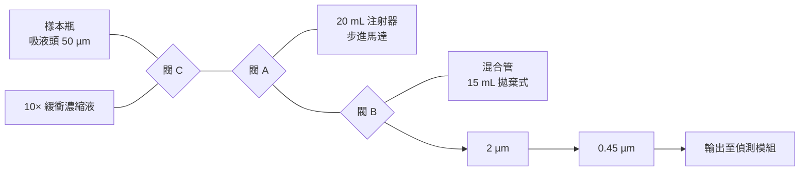
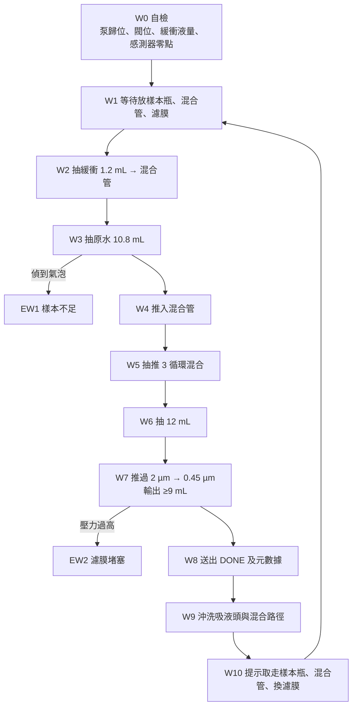

# 水樣標準模組：硬件計劃書

平台的第一個模組，也是標準介面的第一個實例

## 1　摘要與目標

先直接回答一個很合理的疑問：**水模組是不是就只是一張濾膜？**

不是，但差得不遠。它有四件事要做：量體積、過濾、**把基質調成與校準時一致**、記錄樣本資料。第三項是容易被漏掉的那個：天然水的 pH 與離子強度每條溪、每個魚塘都不同，而生物感測器的校準曲線是在一個固定基質下做的。如果把原水直接倒進去，讀數就不能與校準曲線對應。

至於「泥土模組已經包含過濾」——正確，而且不止過濾，它連稱重、注射泵、閥、濾膜座都有。第 3 節專門處理「那為什麼還要另外做一部」這個問題。

| 目標 | 量化指標 |
| --- | --- |
| 輸出符合標準介面 | 經 0.45 µm 過濾、≥ 9 mL、基質已知 |
| 基質一致 | 最終緩衝濃度誤差 ≤ 3%；輸出 pH 落在校準範圍，誤差 ≤ 0.3 |
| 體積準確 | 稀釋倍數誤差 ≤ 2% |
| 全自動 | 使用者只做兩個動作：放樣本瓶、完成後換濾膜 |
| 快 | 單次運行 ≤ 5 min（泥土模組要 70 min） |
| 便宜 | 約為泥土模組一半成本 |

這個模組在平台裡的角色比它本身的複雜度重要得多：它是**標準介面的第一個實例**。一個簡單到幾乎沒有東西會出錯的模組，正好用來把介面、主機通訊和偵測流程全部跑通一次；等到泥土模組接上來時，介面已經是驗證過的，剩下要除的錯只有泥土那部分。

## 2　水樣到底要處理甚麼

### 2.1　顆粒：過濾不只是為了保護儀器

水裡的汞有很大一部分吸附在懸浮顆粒和藻類上。生物感測器讀不到顆粒上的汞，所以如果不過濾，樣本裡就會混了一堆「存在但量不到」的汞，讀數跟實際投入量對不上。**0.45 µm 過濾是環境化學裡「溶解態」的標準定義**，所以這一步同時在做兩件事：保護下游，以及明確地定義我們在量什麼。

實際水樣比泥土濾液更難濾的情況是存在的：魚塘水藻類多、灌溉水泥沙多，都會快速堵住 0.45 µm。所以要三級：吸液頭的 50 µm 尼龍濾布 → 2 µm → 0.45 µm。

### 2.2　基質：這才是「不只是濾膜」的部分

感測器是活細菌。天然水的 pH、硬度、離子強度變化很大，極軟的水甚至會令細胞受渗透壓術迫。而校準曲線是在一個固定基質下做的，樣本要跟它對得上。

做法很簡單：加一份**濃縮緩衝液**（10×），每次加最終體積的 1/10。這樣無論原水是軟是硬、pH 6 還是 8，輸出都落在同一個範圍。額外的好處是：水模組與泥土模組的輸出基質可以設計得接近，兩條校準曲線不至於差得太遠。

模組不調 pH，只量 pH：加完緩衝後讀一次，超出範圍就標記該樣本。主動調 pH 要加酸鹼、要閉環、要搅拌，複雜度跟回報不成比例。

### 2.3　汞的形態：與 UV-AOP 模組的接口

天然水裡的溶解態汞不全是自由的 Hg²⁺：部分與溶解性有機物（腐殖質）錠合，部分是甲基汞。這跟泥土面對的是同一個問題，只是程度輕一點。

所以要說清楚：

- **水模組單獨用** → 量的是「溶解態、感測器可見的汞」。
- **水模組 + UV-AOP 段** → 量的是「溶解態總汞」。

兩個數字的差距本身就是一個有意思的結果，而且做起來很便宜：同一個樣本跑兩次，一次經 UV 一次不經。這也是「模組可以串起來」最容易展示的例子。

### 2.4　故意不做的兩件事

- **不加酸保存**。標準水樣汞分析會加酸保存，但那是為了送去儀器分析；我們的「儀器」是活細菌，加酸就全死。所以樣本必須新鮮量測，要定一個持有時間（見第 8 節）。這是生物感測器先天的限制，不是設計疵疵，但要誠實寫出來。
- **不做預濃縮**。如果樣本濃度低於偵測下限，正規做法是用硫醇樹脂富集或蒸發濃縮。兩者都會帶來回收損失和一大堆額外驗證，超出 iGEM 期間的範圍。但如果 wet lab 最後測出的偵測下限不夠應付實際水樣，這就是下一個要加的模組，而且它同樣插在同一個介面上。

## 3　獨立做，還是用泥土模組的無泥土模式？

泥土模組已經有稱重、注射泵、閥、兩級濾膜，而且它本來就有一個「無泥土空白」模式。技術上用它跑水樣是做得到的，而且成本是零。這個選項要認真考慮。

|  | 沿用泥土模組 | 獨立水模組 |
| --- | --- | --- |
| 零件成本 | 0 | 約 HK$500 |
| 設計工作 | 0 | 很少（沿用同一套設計，只是拿走攪拌和泥土杯） |
| **交叉污染** | 流路見過泥和高濃度萃取液 | 流路只見過清水 |
| 死體積與濾膜 | 為泥漿設計，對清水是浪費 | 照水樣尺寸做 |
| 單次時間 | 要走完整流程 | ≤ 5 min |
| 並行 | 兩種樣本要排隊 | 可以同時跑 |
| 介面驗證 | 要等泥土模組做好 | 第一週就可以跑通介面 |

**決定：獨立做一部最小的水模組，而且先做。**

主要是兩個理由。第一，交叉污染是真問題：泥土萃取液的汞濃度可能比一個乾淨水樣高兩三個數量級。喺同一條流路裡先跑泥再跑清水，就算沖洗到 0.5% 殘留，對低濃度水樣來說仍然是一個假陣性來源。第二，排序：我們希望喺泥土模組裝好之前就驗證到標準介面、UART 指令、主機流程和偵測流程都行得通。水模組是做這件事最便宜、最快的載體。

這個決定不貴，因為水模組沿用泥土模組同一套電子、同一款注射泵、同一種旋塞和同一套 CAD 概念，只是拿走攪拌、稱重可以簡化、閥少一個。設計工作幾乎是零，成本是零件費。

至於泥土模組的「無泥土模式」，保留，但它的用途是**泥土模組自己的空白與 QC**，不是拿來量真實水樣。兩者不衝突。

## 4　設計依據與規格

| 項目 | 設定 | 備註 |
| --- | --- | --- |
| 樣本瓶 | 使用者注入 ≥ 20 mL | 模組只抽其中一部分 |
| 原水取用量 | 10.8 mL |  |
| 緩衝濃縮液 | 10×，加 1.2 mL | 配方要與感測器校準條件對齊 |
| 最終體積 | 12 mL | 輸出 9 mL + 死體積裕量 |
| 稀釋倍數 | 1.11（固定） | 寫入元數據，報告時換算回原水濃度 |
| 過濾 | 50 µm → 2 µm → 0.45 µm | 50 µm 在吸液頭 |
| 抽水流速 | ≤ 10 mL/min |  |
| 過濾流速 | 2–3 mL/min | 與泥土模組一致 |
| 混合 | 混合管內抽推 3 循環 | 無攪拌馬達 |
| 輸出 | ≥ 9 mL |  |
| 單次時間 | ≤ 5 min |  |
| 溫度 | 記錄，不控 |  |
| 持有時間 | 取樣後 ≤ 6 小時，避光、保冷 | 暂定，待 wet lab 驗證 |

### 4.1　兩個減法的設計決定

**不裝稱重感測器。** 泥土模組需要秤，是因為泥土重量事前未知，要按實測重量算加液量。水樣沒有這個問題：體積全部由注射泵決定，水的密度又是 1。注射泵每步體積在校準模式以重量法標定一次就夠。

**不在流路裡放 pH 電極。** 看似應該裝，但玻璃 pH 電極有三個問題：要常湿存和兩點校準（學生團隊很難維持）、參比電極會漏出 KCl 而氯離子會改變汞的形態、電極表面會吸附汞。改為：每個新水源第一次取樣時，用 pH 試紙手動量一次原水並記錄；輸出的 pH 靠緩衝液保證，並在驗證階段以極軟和極硬的水各測一次，證明緩衝能力足夠。

兩個決定的共同邏輯：這個模組的價值在於簡單可靠。每多一個要維護的部件，就多一個在 iGEM 當天會壞的東西。

## 5　架構與流路

跟泥土模組是同一個拓檸：注射器接在閥 A 上，拉就從閥 C 選中的來源或混合管吸液，推就送入混合管或推過濾膜。差別只是泥土模組的「反應杯」變成這裡的「混合管」，而且多了一個閥來選樣本瓶。韌體的狀態機、閥控制、注射泵驅動都可以直接沿用。

**沒有廢液瓶**：清洗液推回已用的混合管，跟管一起棄置——跟泥土模組同一個做法。

**濾膜在輸出前才過**：注意濾膜是接在閥 B 的輸出支路上，而不是在入口。如果在入口就過濾，每抽一次水都要克服濾膜阻力，容易抽出氣泡；放在輸出側就只有最後一次正壓推過，干淨很多。

## 6　子系統設計

### 6.1　樣本瓶與吸液頭

- 樣本瓶：50 mL 玻璃或 FEP 瓶，由使用者現場裝水後放入模組座。不用一般軟塑料瓶，原因見 8.1。
- 吸液頭：與泥土模組同一個做法——一段 8 mm PTFE 管外包 50 µm 尼龍濾布，再接細 PTFE 管。管口離瓶底 10 mm，避開沉底的泥沙。
- 樣本瓶是拋棄式或專瓶專用；吸液頭每次運行後沖洗。

### 6.2　注射泵與閥

與泥土模組完全相同：20 mL Luer-lock PP/PE 兩件式注射器，NEMA17 + T8 絲杆，TMC2209 驅動，限位開關歸位。三個醫用三通旋塞各配一個 MG90S。用 20 mL 而不是 10 mL，是為了一次抽完 10.8 mL 原水，不必分兩次。

### 6.3　氣泡偵測

這是水模組比泥土模組多出來的一個零件。使用者有可能裝不夠水，或者瓶子歪了，注射器就會抽入空氣。空氣不像堵塞那樣會產生真空，壓力感測器偵測不到，所以要另外裝：一段透明 FEP 短管夷在入口管路上，兩邊一顆紅外 LED 一顆光電晶體。有水跟有氣的透光差很大，銀兩塊錢就解決。一偵到氣泡就停泵並報錯，總好過送出一個體積不對的樣本。

### 6.4　混合管與混合

- 15 mL PP 離心管，拋棄式，放在一個 3D 打印管座裡。管蓋固定在模組上，有兩個孔：雙向液管、通氣孔。
- 混合靠注射泵抽推：抽 10 mL 再推回，重複 3 次。沒有攪拌馬達，少一個會壞的東西。混合均勻度在測試階段用色素驗證。
- 先推緩衝再抽原水，因為緩衝是干淨試劑；反過來會把樣本殘留帶進緩衝瓶。

### 6.5　過濾組

2 µm 和 0.45 µm 濾器座以 Luer 串接，直接裝在閥 B 的輸出支路上。兩張濾膜每次更換。如果測試發現清潔水源（例如自來水）的 2 µm 濾膜幾乎沒有負載，可以改成按水源決定要不要用前級，省耗材。

### 6.6　控制電子

| 部件 | 用途 |
| --- | --- |
| ESP32 | 狀態機、UART、記錄 |
| TMC2209 + NEMA17 + 限位開關 | 注射泵 |
| MG90S × 3 | 三個三通旋塞 |
| 壓力感測器 | 過濾堵塞偵測 |
| 紅外 LED + 光電晶體 | 氣泡偵測 |
| DS18B20 | 記錄溫度 |
| 0.96" OLED + 2 按鍵 + 蜂鳴器 | 獨立操作 |
| 12 V 2 A + 5 V 降壓 | 供電；比泥土模組少了攪拌馬達 |

## 7　自動化流程與控制邏輯

### 7.1　幾個要點

- **先緩衝後原水**。緩衝是干淨試劑，先走一遍管路等於預充；反過來會把樣本殘留帶進緩衝瓶。
- **W3 全程監察氣泡**。一偵到就停，因為體積不對會直接變成濃度錯，而且從讀數上完全看不出來。寫在元數據裡的氣泡事件數是一個有用的 QC 指標。
- **W7 不棄首段**。兩張濾膜每次都是乾的新膜，沒有殘液稀釋問題；與泥土模組同一個理由。新膜對汞的吸附損失由 10.2 的測試確認。
- **W9 沖洗吸液頭**。緩衝液經閥 C 推回樣本瓶，沖洗吸液頭與入口管；樣本瓶裡剩余的水之後連瓶棄置。接著再用緩衝液沖混合路徑，沖洗液留在已用的混合管裡。
- **混合管到位偵測**。管座裡裝一個微動開關。沒放管就開始，整個模組會把液體注到桌面上。這種錯一定會有人犯，十塊錢就防到。

### 7.2　錯誤代碼

| 代碼 | 情況 | 處理 |
| --- | --- | --- |
| EW1 | 入口偵到氣泡（樣本不足或瓶歪） | 停泵，把已抽的推回樣本瓶，提示補水後重試 |
| EW2 | 過濾壓力過高 | 停泵，提示更換濾膜；已輸出部分標記為不完整 |
| EW3 | 緩衝濃縮液不足 | 開始前拒絕運行 |
| EW4 | 注射泵或閥異常（壓力不合理） | 停機，提示檢查管路 |
| EW5 | 混合管未到位 | 拒絕開始 |
| EW6 | 輸出不足 9 mL | 標記樣本無效，記錄實際體積 |

### 7.3　特別模式

- **系統空白**：樣本瓶裝去離子水，跑完整流程。每批樣本前跑一次。
- **總汞模式**：輸出接到 UV-AOP 段，與不接的結果對比。
- **加標回收**：不用改硬件——在樣本瓶裡手動加已知量標準液，再跑正常流程就是了。模組不設加標位，是故意的：多一個汞試劑瓶在模組裡，就多一個污染源和一個安全問題。
- **手動模式與校準模式**：與泥土模組一致。校準模式以重量法標定注射泵每步體積與管路死體積。

## 8　取樣與現場使用

這節不是硬件，但對結果的影響可能比模組本身更大。水樣汞分析最常見的失敗不是儀器不準，是樣本在送到儀器之前已經變了。

### 8.1　容器

- 用**硬質玻璃（實驗室級）或 FEP**，不用一般 PET/PE 水瀦。汞會吸附在軟塑料壁上，低濃度樣本在幾小時內就可能損失明顯一部分。
- 瓶子用前洗淨，用法由導師指定；專瓶專用，不要跟其他實驗共用。
- 現場先用樣本水淊洗瓶 3 次再正式裝。

### 8.2　取樣

- 裝滿、少頂空、旋緊；手指不碰瓶口內側，戴手套。
- 每次外出帶一個**現場空白**：一瓶去離子水，在現場開蓋再合上，跟樣本一樣運輸和量測。它會告訴你有沒有在路上被污染。
- 現場記錄：地點、時間、水溫、天氣（剛下過雨影響很大）、外觀與濁度、用試紙量的原水 pH。

### 8.3　運輸與持有時間

避光、保冷（冰袋），**暫定 6 小時內量測**。這個數字是占位值，要由 10.2 的 Y2 實驗定出來——那個實驗全部用水做，而且輸出的就是這條規格。

標準水質汞分析靠加酸保存來延長持有時間，我們不能用（見 2.4）。所以現場到實驗室的時間是一個真的限制，要寫進 SOP 和 Wiki，不要蹟過。

### 8.4　污染防護

汞分析的背景值很容易被環境拉高。戴手套；不要在有汞溫度計、汞燈或舊式荧光燈破裂過的房間裡處理樣本；樣本瓶不要與泥土樣本放在同一個箱裡。空白樣本是檢查這些問題的唯一方法，所以每批都要跑。

## 9　物料清單與成本估算

港幣粗估。假設與泥土模組一起落單，共用部分備用料。

| 類別 | 項目 | 數量 | 估計（HK$） | 備註 |
| --- | --- | --- | --- | --- |
| 控制 | ESP32 開發板 | 1 | 40 |  |
| 注射泵 | NEMA17 + T8 絲杆 + 導軸 + 限位開關 | 1 套 | 120–200 | 與泥土模組同款 |
| 驅動 | TMC2209 | 1 | 25 |  |
| 注射器 | 20 mL Luer-lock PP/PE | 20 | 40–80 | 消耗品 |
| 閥 | 醫用三通旋塞 | 5 | 25–40 | 3 用 2 備 |
| 閥驅動 | MG90S 伺服 | 4 | 40–60 |  |
| 感測 | 壓力感測器 | 1 | 20–60 | 堵膜偵測 |
| 感測 | 紅外 LED + 光電晶體 + FEP 透明短管 | 1 套 | 30 | 氣泡偵測 |
| 感測 | DS18B20 | 1 | 15 |  |
| 感測 | 微動開關 | 1 | 5 | 混合管到位 |
| 過濾 | 25 mm 濾器座 | 2 | 0–80 | 可與泥土模組輪流 |
| 管路 | 細 PTFE 管、8 mm PTFE、Luer 及 1/4-28 接頭 | 1 套 | 50–80 | 8 mm 管已有 |
| 耗材 | 50 µm 尼龍濾布 | — | 0 | 已買 |
| 耗材 | 15 mL PP 離心管（混合管） | 50 | 40–60 | 拋棄式 |
| 容器 | 硬質玻璃或 FEP 樣本瓶 50 mL | 6 | 60–150 | 現場取樣用 |
| 儲液 | 500 mL PP 瓶（緩衝濃縮液） | 1 | 10 |  |
| 人機介面 | OLED、按鍵、蜂鳴器 | 1 套 | 30 |  |
| 電源 | 12 V 2 A + 5 V 降壓 | 1 套 | 50 |  |
| 結構 | PETG 線材 | — | 60–100 |  |
| 雜項 | 螺絲、線材、連接器 | — | 40–80 |  |
| **合計** |  |  | **約 700–1,185** |  |

比泥土模組便宜，但沒有便宜一半——因為注射泵那套機械佔了很大比例，而它是省不到的。省到的是攪拌馬達、秤、兩個閥和一個試劑瓶。如果與泥土模組一起落單，共用備用料和零頭零件，實際增加的支出會更接近下限。

## 10　測試與驗證計劃

### 10.1　無汞測試

| 測試 | 方法 | 合格標準 |
| --- | --- | --- |
| X1 體積準確度 | 各步各量 10 次，天平複秤 | 誤差 ≤ 2%，CV ≤ 1% |
| X2 稀釋倍數 | 以已知電導率的鹽水當「原水」，量輸出電導率 | 實測倍數與 1.11 差 ≤ 2% |
| X3 混合均勻度 | 色素當緩衝，輸出分三段取樣比較 | 三段吸光度差 ≤ 3% |
| **X4 緩衝能力** | 去離子水、硬水、pH 5 水、pH 9 水各跑一次 | 輸出 pH 全部落在校準範圍，極差 ≤ 0.3 |
| X5 濁度與過濾 | 自來水、魚塘水、雨後渠水各 3 次 | ≥9 mL 在 5 min 內完成 |
| X6 氣泡偵測 | 故意裝 5 mL 水跑 10 次 | 10/10 報 EW1，無誤輸出 |
| X7 殘留 | 色素跑一次，再跑去離子水空白 | 殘留 ≤ 0.5% |
| X8 連續運行 | 10 次完整流程 | 無漏液、無未處理錯誤 |
| X9 介面 | 與主機跑完整 UART 指令集 | 全部指令正確回應 |

X9 是這部機存在的主要理由之一，要認真做：它跑通了，泥土模組和 UV 段接上來時就只需要證自己。

### 10.2　水溶液汞測試（校內可做）

整個平台裡，這是最容易做、回報最高的一組實驗：全部用稀釋汞標準溶液，沒有泥土。

| 實驗 | 做法 | 輸出 |
| --- | --- | --- |
| Y1 回收率 | 自來水與池水加已知量 Hg²⁺，經模組 vs 手加緩衝直接量 | 差異 ≤ 10% 即硬件未引入偏差 |
| **Y2 容器吸附與持有時間** | 同一加標水分裝玻璃、FEP、PE 瓶，在 0、2、6、24 h 量 | 定出容器材料與持有時間規格 |
| Y3 基質效應 | 不同水源加同樣的標準量 | 回收率一致性 CV ≤ 15% |
| Y4 實際偵測下限 | 在真實水基質中做校準曲線 | 與純水校準比較，寫入報告 |
| Y5 生物負載 | 池水濾液直接培養，看有否雜菌生長 | 決定要不要加 0.22 µm |
| Y6 餘氯 | 自來水直接跑 vs 靜置過夜後跑 | 定出自來水要不要預處理 |

Y2 值得特別指出：它的輸出不是一個「做到了」的勾，而是兩條真正的規格（用咪種瓶、多久內要量測）。這種由自己實驗定出來的規格，在 Wiki 上比引文獻有說服力得多。

Y5 和 Y6 是水樣獨有的問題，泥土那邊不會遇到，容易被漏掉：池水濾液不是無菌的，而自來水有餘氯，兩樣都可能影響以活細菌為基礎的讀數。

### 10.3　合作實驗室（選做）

把幾個現場水樣分成兩份，一份經模組與感測器，一份送去做 CVAAS 或 ICP-MS，比對兩條數據。有機會的話值得做，因為這是整個平台唯一一個「和標準方法正面對比」的機會，而水樣是最容易安排的那一種（不用處理含汞固體廢物）。

## 11　風險、限制與待決事項

### 11.1　技術風險

| 風險 | 影響 | 緩解 |
| --- | --- | --- |
| 汞吸附在容器或管壁 | 低濃度樣本損失明顯 | 玻璃或 FEP 樣本瓶；PTFE 流路；Y2 實測 |
| 持有時間過長 | 同上 | Y2 定出規格並寫進 SOP |
| 濁度高堵膜 | 輸出不足 | 三級過濾；壓力監察；X5 找出極限 |
| 樣本不足抽入空氣 | 濃度錯而且看不出 | 氣泡偵測（X6 驗證） |
| 外來污染 | 假陣性 | 每批系統空白 + 現場空白；戴手套 |
| 濾液不是無菌 | 雜菌影響以活細菌為基礎的讀數 | Y5 決定要不要加 0.22 µm；縮短濾液到讀數的時間 |
| 自來水餘氯 | 對活細菌有毒 | Y6；注意常用的除氯劑（硫代硫酸鈉）會錠合汞，不能用 |
| 緩衝配方與感測器不匹配 | 校準曲線對不上 | 配方由 wet lab 定，寫死在介面文件裡 |

### 11.2　科學與測量限制

- **操作定義**：單獨用時量的是「溶解態、感測器可見的汞」，不是水樣總汞。接上 UV-AOP 段才是溶解態總汞。兩個數字要分開報，不要混用。
- **偵測下限**：水質標準裡的汞限值非常低。感測器能不能到那個水平，要等 Y4。如果不到，要誠實地說「適合篩查污染點附近的水，不適合判斷是否符合飲用水標準」，而不是模糊帶過。預濃縮模組是對應的解法，但不在 iGEM 期間做。
- **稀釋**：加緩衝會把樣本稀釋 1.11 倍，即偵測下限效果上升高了同樣倍數。這是為了基質一致性付的價，很划算，但要寫明。
- **單次快照**：一個水樣只代表那一刻。雨後、排放前後差別可以很大。這是取樣設計的問題，不是模組的問題，但 Human Practices 裡應該提。

### 11.3　待決事項

- [ ] 緩衝濃縮液配方與倍數（wet lab 根據感測器條件定）
- [ ] 持有時間與樣本瓶材料（等 Y2）
- [ ] 要不要加 0.22 µm 第三級（等 Y5）
- [ ] 自來水餘氯要不要預處理，用咪種方法（等 Y6）
- [ ] 稀釋倍數要不要做成可調（高濃度樣本需要更大稀釋）
- [ ] 現場取樣地點名單（配合 Human Practices）

## 12　時間表

這是三個模組裡最快的一個，而且應該排在最前。

| 階段 | 週數 | 工作 | 交付物 |
| --- | --- | --- | --- |
| 0 定稿與訂貨 | 第 1 週 | 與泥土模組一起落單 | 訂單 |
| 1 CAD 與打印 | 第 1–2 週 | 瓶座、混合管座、泵支架、外殼（多數與泥土模組共用） | CAD 檔 |
| 2 電子與韌體 | 第 2–3 週 | 注射泵、三個閥、氣泡偵測、狀態機、UART | 可運行的韌體 |
| 3 無汞測試 | 第 3–4 週 | X1–X9 | 測試紀錄 |
| **4 介面打通** | 第 4 週 | 與主機、偵測模組跑完整一次 | **平台的第一個端到端 demo** |
| 5 水溶液汞測試 | 第 4–6 週 | Y1–Y6 | 持有時間、容器、偵測下限等規格 |
| 6 現場取樣 | 第 6 週起 | 配合 Human Practices 到實地取樣 | 真實數據 |
| 7 文件 | 貫穿全程 | 裝配指南、取樣 SOP、Wiki | 開源檔案 |

階段 4 是整個計劃最有價值的里程碑：第四週左右就有一個「倒水進去、出讀數」的完整系統。之後泥土模組和 UV 段做好時，是插到一個已經跑得動的系統上，而不是同時除三個部分的錯。
