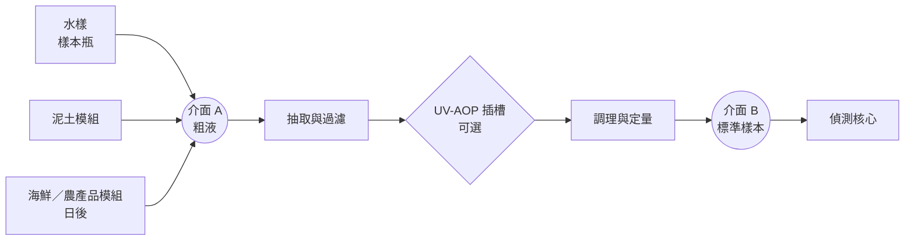
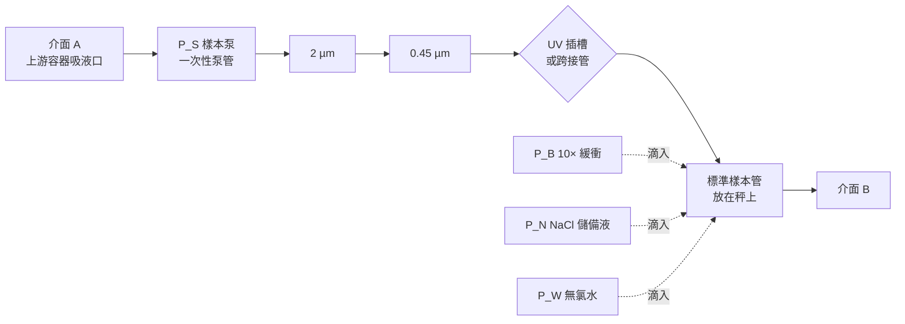
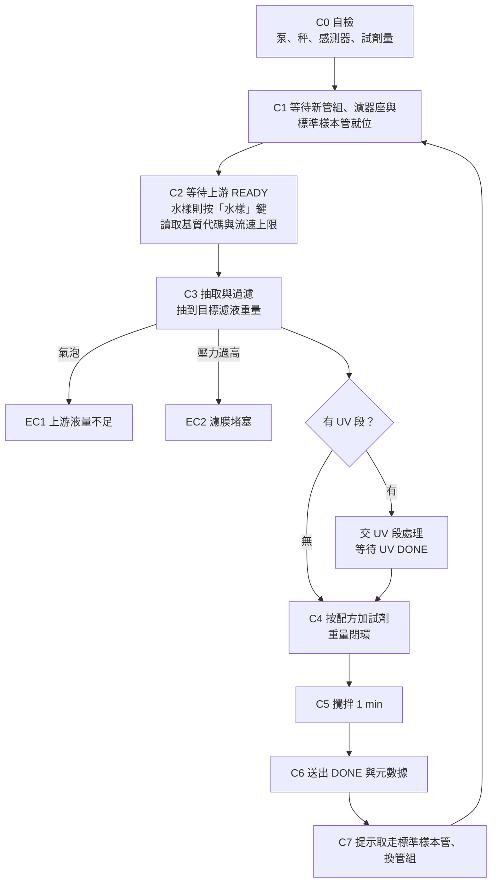

# 標準調理模組（水模組）：硬件計劃書

所有樣本最後都經過的模組；水樣只是「沒有上游模組」的最簡單情況

## 1　摘要與目標

這個模組原本只為水樣而設。現在把它升級為平台的**標準調理模組**：無論樣本是水、泥土萃取液，還是日後的海鮮消解液，最後都經它抽取、過濾、調成同一種基質、定量，才交給偵測核心。水樣直接放上來；其他樣本先由各自的上游模組變成「粗液」，再交給它。

升級有三個理由：

- **標準由硬件保證**。偵測核心只會收到同一個模組產生的樣本，所以全平台只有一個品質控制點和一套校準流程，而不是靠每個模組各自遵守文件。
- **上游模組大幅簡化**。泥土模組只需負責「固體 → 粗液」（稱重、加試劑、攪拌、靜置），過濾、定量和調理都不用再各做一次。
- **污染控制只需解決一次**。所有接觸樣本的部件集中在這個模組，並做成每次更換的一次性樣本管組。

| 目標 | 量化指標 |
| --- | --- |
| 輸出符合介面 B | 經 0.45 µm 過濾、≥ 9 mL（待偵測模組確認）、標準基質、附元數據 |
| 基質一致 | 緩衝與 NaCl 最終濃度誤差 ≤ 3%；pH 落在校準範圍內 |
| 稀釋倍數準確 | 全部由重量計算，誤差 ≤ 2% |
| 沒有樣本之間的殘留 | 樣本路徑每次整套更換；空白低於偵測下限 |
| 全自動 | 使用者只做三件事：放好樣本、換一次性管組、取走標準樣本管 |
| 快 | 單次 ≤ 10 min（不計 UV 段） |

水樣在這個架構裡不再需要專屬模組，因為「水樣模組」就是這個調理模組在沒有上游模組時的運作方式。

## 2　在平台中的位置

模組內部分兩段，中間預留一個 UV-AOP 插槽：

1. **抽取與過濾**：由上游容器抽出粗液，經 2 µm → 0.45 µm 過濾。
2. **UV-AOP（可選）**：要量有機汞，或跑泥土路線 2 時插入；不用時以一條短管跨接。
3. **調理與定量**：按配方加入緩衝與 NaCl，需要時稀釋，全部以重量計量。

次序必須是「過濾 → UV → 調理」。UV 需要清澈的液體，懸浮顆粒會散射和遮擋光線；而有機緩衝劑會消耗 UV/H₂O₂ 產生的自由基，自己也會被氧化，所以緩衝一定在 UV 之後才加。

用平台的相機比喻來說：偵測核心是機身，上游模組是鏡頭，這個模組就是實體化的卡口——每個鏡頭都要經過它，機身才接得上。一個模組可以服務多個上游模組：泥土萃取要 70 分鐘，調理只要幾分鐘，所以幾部便宜的上游模組可以同時跑，共用一部調理模組和一個偵測核心。

## 3　兩個介面

平台裡所有模組之間的實體介面都是同一種東西：**一個蓋上有吸液口的容器**。下游模組用自己的管路由這個容器抽液，上游模組不需要出液泵。「標準」一詞以後只指介面 B，而且只有這個模組會產生它。

|  | 介面 A：粗液 | 介面 B：標準樣本 |
| --- | --- | --- |
| 由誰產生 | 上游模組；水樣則由使用者裝瓶 | 只有本模組 |
| 容器 | 上游模組自己的容器（泥土杯、樣本瓶） | 15 mL 拋棄式標準樣本管 |
| 實體接口 | 蓋上一個 Luer 口，下接吸液頭（50 µm 濾布），深度固定 | 取走時換上附 Luer 口的標準管蓋，供偵測核心取樣 |
| 液體 | 已靜置；只經 50 µm 濾布；基質屬已知清單之一 | 0.45 µm 過濾；標準基質；體積固定 |
| 體積 | 可抽 ≥ 12 mL 而不吸入空氣 | ≥ 9 mL（待偵測模組確認） |
| 資料 | 上游模組 ID、基質代碼、NaCl 濃度、樣本資料、最大抽取流速 | 上游全部資料 + 配方、各試劑重量、總稀釋倍數 |

幾個細節：

- **吸液頭屬於本模組的一次性管組**，每次隨管組更換，所以上游模組不必清洗吸液頭。
- **水樣的上游容器**：樣本瓶加一個標準瓶蓋轉接器，蓋上有同樣的 Luer 口，吸液頭同樣由一次性管組提供。轉接器沒有電子零件，所以水樣由使用者在本模組上按「水樣」鍵開始：基質代碼固定為 WATER，抽取流速上限 10 mL/min，跳過 C2 的 READY（見第 7 節）。
- **通訊**：沿用平台的 UART 文字指令。上游模組完成後向主機送 READY（附基質代碼與最大抽取流速），主機再通知本模組開始；抽取完畢後主機向上游模組送 PULLED。各模組只跟主機對話，以免以後每多一個模組就要改協議。
- **基質代碼不由人手輸入**：上游模組自動回報；水樣只有一個專用按鍵，不用打字。配方錯配是這個架構最容易出的錯，而且從讀數上看不出來。

## 4　設計依據與規格

| 項目 | 設定 | 備註 |
| --- | --- | --- |
| 抽取量 | 約 10–11 g 濾液，另加管組保留約 1.5 mL | 實際數字由配方與稀釋倍數決定 |
| 抽取流速 | 泥土類 ≤ 5 mL/min；水樣 ≤ 10 mL/min | 由介面 A 的資料決定，避免攪起沉積泥 |
| 過濾 | 50 µm（吸液頭）→ 2 µm → 0.45 µm | 濾膜隨管組每次更換 |
| 標準樣本體積 | 12 mL | 輸出 ≥ 9 mL 加餘量 |
| 標準基質 | 1× 緩衝 + NaCl c\* | c\* 等於泥土路線 1 的 NaCl 濃度（佔位 50 mM） |
| 乾淨試劑 | 10× 緩衝、NaCl 儲備液、無氯水 | 三個乾淨泵，見 5.2 |
| 計量方式 | 全部以重量計（100 g 秤） | 與泥土模組同一種做法 |
| 稀釋倍數 | 預設取最小值；1–20 倍可設 | 高濃度樣本用 |
| 混合 | 小型磁力攪拌 | 秤重時停止 |
| UV 插槽 | 兩個 Luer 口 + UART 與在位偵測接頭 | 不用時以跨接管連通 |
| 單次時間 | ≤ 10 min | 不計 UV 段 |
| 溫度 | 記錄，不控 |  |

### 4.1　規格按最髒的輸入設計

這個模組要處理的不再只是清水，而是平台裡最髒的輸入——泥土上清液（日後可能還有含油脂的海鮮消解液）。所以濾膜容量、壓力上限和抽取流速都按泥土上清液來定，2 µm 預過濾和壓力監測不能省。清水只會更容易。

### 4.2　刻意不做的事

- **不加酸保存**。標準水樣汞分析會加酸保存，但那是為了送去儀器分析；我們的「儀器」是活細菌，加酸就全死。所以水樣必須新鮮量測（見第 8 節）。這是生物感測器先天的限制，要誠實寫出來。
- **不在流路裡放 pH 電極**。玻璃 pH 電極要常濕存和兩點校準（學生團隊很難維持）、參比電極會漏出 KCl 而氯離子會改變汞的形態、電極表面會吸附汞。輸出的 pH 由緩衝保證，水樣原水 pH 用試紙手動記錄一次。
- **不做預濃縮**。如果樣本濃度低於偵測下限，正規做法是用硫醇樹脂富集或蒸發濃縮，兩者都會帶來回收損失和大量額外驗證，超出 iGEM 期間的範圍。如果 wet lab 測出的偵測下限不夠應付實際水樣，這就是下一個要加的段，而且可以做成與 UV 同樣的插槽段。

## 5　流路與子系統

實線是樣本路徑（髒），虛線是試劑路徑（乾淨）。兩者在物理上完全分開：試劑滴嘴懸在標準樣本管液面上方，永不接觸樣本。

### 5.1　一次性樣本管組

每次運行整套更換：吸液頭 → 細 PTFE 管 → 泵管段 → 2 µm 濾器 → 0.45 µm 濾器 → 出口短管（不插 UV 段時連同跨接管）。濾膜每次換新；兩個濾器座和標準樣本管裡的攪拌子是僅有的重複使用部件，用過即整件換下、離機清洗（見下及 5.3）。所以機上沒有樣本之間的殘留，也不需要沖洗步驟和廢液瓶。

- **為何用蠕動泵**：整條樣本路徑只有一條管接觸液體，沒有閥、沒有注射器內壁、沒有死角。之前考慮過的注射泵方案，正是因為同一支注射器要反覆抽推樣本和試劑，殘留無法完全沖走，所以放棄。
- **吸液頭**：細 PTFE 管末端外包 50 µm 尼龍濾布，外徑 ≤ 5 mm，以便放進泥土杯葉輪旁邊。水樣瓶蓋轉接器沒有葉輪，可以用現有的 8 mm PTFE 管做較粗的吸液頭，濾布面積更大。
- **泵管材料**：常用的矽膠管會吸附少量汞。因為每次換新，這變成一個固定、可校準的損失，而不會變成交叉污染；損失大小由 10.2 的 Y4 量出，必要時換材料。
- **使用方式**：管組預先組裝好封袋，現場更換只需接三個 Luer 接口、把泵管壓進泵頭。
- **濾器座**：沿用現有的 25 mm 濾器座，濾膜每次換新。濾器座接觸樣本但不能拋棄，做法和 UV 段的石英管一樣：兩套輪流，每次運行隨管組整件換下，離機清洗晾乾，清洗方法由導師定，清洗液按汞廢物處理。預算許可的話，改用一次性 Luer 濾器更省事（見 11.3）。

### 5.2　乾淨試劑

三個蠕動泵 P\_B、P\_N、P\_W，只接觸乾淨試劑，所以泵管不必每次換，定期更換即可。

| 試劑 | 用途 | 備註 |
| --- | --- | --- |
| 10× 緩衝 | 把 pH 和緩衝能力調成標準 | 配方由 wet lab 按感測器條件定 |
| NaCl 儲備液 | 把每個樣本補到相同的氯離子背景 | 佔位 0.5 M |
| 無氯水 | 稀釋 | 去離子水或蒸餾水 |

**為何是三種而不是兩種**：要同時固定「緩衝濃度」、「NaCl 濃度」和「稀釋倍數」三個量，再加上總體積，數學上需要樣本以外三種獨立的試劑。少一種，稀釋倍數就會被前兩個條件鎖死，高濃度樣本便無法自動稀釋。所以這個模組是四個泵：一個髒，三個乾淨。

加液方式與泥土模組相同：先快速泵到目標的 90%，再以短脈衝逼近，每次脈衝後等秤讀數穩定。泵管老化只會令流量漂移，秤重閉環會自動補償。

### 5.3　標準樣本管與秤

- 15 mL PP 拋棄式管，放在 100 g 稱重感測器上的管座內；管座有微動開關偵測管是否到位。
- 管蓋固定在模組上，有五個孔：樣本入口、三個試劑滴嘴、通氣孔；蓋與管不接觸，以免影響稱重。完成後使用者取走管，換上附 Luer 口的標準管蓋（介面 B），交給偵測核心。
- 管內放一顆小攪拌子（每次更換或輪流酸洗），下方是小型磁力攪拌器；秤重時停止攪拌。

### 5.4　壓力與氣泡監測

- **壓力**：濾器前裝壓力感測器，經一段困住空氣的短管連接，感測器不接觸液體，所以不屬於一次性管組。超過閾值即判為堵膜。
- **氣泡**：入口管路夾一段透明 FEP 短管，配紅外 LED 與光電晶體，偵測吸入空氣（上游容器液量不足）。氣泡不會造成真空，壓力感測器看不到，所以要分開裝。

### 5.5　UV 插槽

兩個 Luer 口（「濾液出」、「回流入」）加一個 UART 與在位偵測接頭（UV 段自備電源，不由本模組供電）。插上 UV-AOP 段時，濾液先進 UV 段，處理完再送入標準樣本管；沒有插時，用一條短跨接管把兩個口連通（跨接管接觸樣本，屬一次性管組）。韌體經 UART 偵測 UV 段是否存在，自動改用對應配方。插槽的設計也預留給日後其他中間段（例如預濃縮）。

### 5.6　控制電子

| 部件 | 用途 |
| --- | --- |
| ESP32 | 狀態機、配方計算、UART、記錄 |
| 4 個 12 V 蠕動泵 | P\_S、P\_B、P\_N、P\_W |
| DRV8833 | P\_S（可反轉，用於把液體送回上游容器） |
| MOSFET 模組 × 3 | 三個乾淨泵 |
| HX711 + 100 g 稱重感測器 | 所有液體計量 |
| 壓力感測器 | 堵膜偵測 |
| 紅外 LED + 光電晶體 | 氣泡偵測 |
| 微動開關 | 標準樣本管到位 |
| 小型磁力攪拌器 | 混合 |
| DS18B20 | 記錄溫度 |
| 0.96" OLED + 2 按鍵 + 蜂鳴器 | 獨立操作 |
| 12 V 2 A 電源 + 5 V 降壓 | 供電 |

## 6　配方：基質一致與稀釋

**原則**：選一個標準基質（1× 緩衝 + NaCl c\*，c\* 等於泥土路線 1 的萃取濃度），其他來源由本模組補到同一個背景。這樣偵測核心看到的每個樣本，氯離子背景和緩衝都相同，汞的形態也相同，有機會只需一條校準曲線。

選泥土萃取液的 NaCl 濃度做標準，是因為它是最「難改」的一個：萃取液本身已含 NaCl，不可能拿走；反而水樣只需加 NaCl 就能對齊。

| 輸入 | 基質代碼 | 本模組要加 | 備註 |
| --- | --- | --- | --- |
| 水樣 | WATER | 緩衝 + NaCl（補到 c\*）＋水（如需稀釋） | 天然淡水氯離子通常很低，可忽略 |
| 泥土 NaCl 萃取液（路線 1） | SOIL-NACL | 緩衝 + 少量 NaCl（補回被緩衝稀釋的部分）＋水（如需稀釋） | 萃取液本身已含 c\* |
| 泥土半胱氨酸萃取液（路線 2） | SOIL-CYS | 必須經 UV 段；之後同下一行 | 未插 UV 段即拒絕運行（EC7）：汞被半胱氨酸鎖住，不經 UV 讀數會嚴重偏低 |
| 經 UV-AOP 的樣本 | 原代碼 + UV | 只補 NaCl 與水；最終重量按實際送達的緩衝量決定 | UV 段的酶液已以 10× 緩衝配製，見 UV-AOP 計劃書 |

**計算方法**：已知濾液重量、輸入的 NaCl 濃度、是否已含緩衝、目標稀釋倍數，韌體解一組質量平衡方程，得出三種試劑各加多少。加完後以實際重量重算一次稀釋倍數，寫入元數據。總稀釋倍數是每一段稀釋倍數的乘積（例如 UV 段 × 調理段），每一段都由重量計算。

**要說清楚的限制**：

- 基質一致只保證氯離子、緩衝和 pH 相同。半胱氨酸路線經氧化後的殘餘物仍與 NaCl 路線不同，那條路線可能仍需要自己的校準曲線。
- 「一條校準曲線就夠」是要用實驗證明的主張，不是推論（見 10.2 的 Y3）。
- 加 NaCl 會把水樣中的汞轉成氯錯合物。這正是目的（與泥土萃取液一致），但感測器對氯錯合汞的反應要由 wet lab 確認。
- c\* 由泥土路線 1 的乾實驗結果決定。c\* 一改，整個平台的標準基質就跟著改，校準曲線要重做。

## 7　自動化流程與控制邏輯

### 7.1　幾個要點

- **C3 按上游給的流速上限抽取**。泥土類容器用 ≤ 5 mL/min，避免攪起沉積泥；水樣可以快一點。
- **先樣本後試劑**。先量到實際送達的濾液重量，再按這個數字計算試劑，所以濾膜和管組吸住多少液體都不影響準確度。這和泥土模組「先稱泥、再加液」是同一個邏輯。
- **沒有沖洗步驟**。樣本路徑每次整套更換；試劑管路從未接觸樣本。
- **開機預充**。每日第一次運行前，放一個預充管，三個乾淨泵各泵約 1 mL 排走氣泡，並以秤確認每個泵都有出液。
- **每批先跑系統空白**：用去離子水當水樣跑一次完整流程。
- **插上 UV 段時**：C3 的濾液改送進石英管，由 UV 段的秤量重量並通知停泵；UV 段處理完，由它的轉送泵把液體送回標準樣本管。本模組按實際收到的緩衝量決定最終重量，再補 NaCl 與水（見 UV-AOP 計劃書第 6 節）。

### 7.2　錯誤代碼

| 代碼 | 情況 | 處理 |
| --- | --- | --- |
| EC1 | 入口偵到氣泡（上游容器液量不足） | 停泵，反轉把管內液體送回上游容器，提示檢查 |
| EC2 | 過濾壓力過高 | 停泵，提示換管組；已收集部分標記為不完整 |
| EC3 | 試劑不足 | 開始前拒絕運行 |
| EC4 | 標準樣本管或管組未就位 | 拒絕開始 |
| EC5 | 加液超時或超量 | 標記樣本無效 |
| EC6 | 上游模組或 UV 段無回應 | 停在當前狀態，等待主機指示 |
| EC7 | 基質代碼不在已知清單內，或配方需要的 UV 段未插上 | 拒絕抽取，提示更新配方 |

### 7.3　特別模式

- **系統空白**：去離子水當水樣。
- **總汞模式**：插上 UV 段。同一個樣本「經 UV」與「不經 UV」的差別，就是有機汞（及被溶解有機物抓住的汞）那一部分。
- **稀釋模式**：指定稀釋倍數，用於超出量程的樣本。
- **加標回收**：在上游容器中手動加已知量標準液後正常運行；模組不設汞試劑位，是故意的，多一個汞試劑瓶就多一個污染源和安全問題。
- **手動與校準模式**：用已知重量砝碼校秤；各泵以重量法校正每秒流量（只用於加速逼近，最終以秤為準）。

## 8　取樣與現場使用

這節不是硬件，但對結果的影響可能比模組本身更大。水樣汞分析最常見的失敗不是儀器不準，是樣本在送到儀器之前已經變了。

### 8.1　容器

- 用**硬質玻璃（實驗室級）或 FEP**，不用一般 PET/PE 水瓶。汞會吸附在軟塑料壁上，低濃度樣本在幾小時內就可能損失明顯一部分。
- 瓶子用前洗淨，清洗方法由導師指定；專瓶專用，不要跟其他實驗共用。
- 現場先用樣本水潤洗瓶 3 次再正式裝。

### 8.2　取樣

- 裝滿、少頂空、旋緊；手指不碰瓶口內側，戴手套。
- 每次外出帶一個**現場空白**：一瓶去離子水，在現場開蓋再合上，跟樣本一樣運輸和量測。它會告訴你有沒有在路上被污染。
- 現場記錄：地點、時間、水溫、天氣（剛下過雨影響很大）、外觀與濁度、用試紙量的原水 pH。

### 8.3　運輸與持有時間

避光、保冷（冰袋），**暫定 6 小時內量測**。這個數字是佔位值，要由 10.2 的 Y2 實驗定出來——那個實驗全部用水做，而且輸出的就是這條規格。

標準水質汞分析靠加酸保存來延長持有時間，我們不能用（見第 4 節）。所以現場到實驗室的時間是一個真的限制，要寫進 SOP 和 Wiki，不要略過。

### 8.4　污染防護

汞分析的背景值很容易被環境拉高。戴手套；不要在有汞溫度計、汞燈或舊式螢光燈破裂過的房間裡處理樣本；樣本瓶不要與泥土樣本放在同一個箱裡。空白樣本是檢查這些問題的唯一方法，所以每批都要跑。

## 9　物料清單與成本估算

港幣粗估，落單前要報價。已有的濾膜和 50 µm 濾布不計入。

| 類別 | 項目 | 數量 | 估計（HK$） | 備註 |
| --- | --- | --- | --- | --- |
| 控制 | ESP32 開發板 | 1 | 40 |  |
| 泵 | 12 V 蠕動泵 | 4 | 160–320 | P\_S 選低流量型號 |
| 驅動 | DRV8833 + MOSFET 模組 | 1 + 3 | 40–60 | P\_S 可反轉 |
| 稱重 | 100 g 荷重元 + HX711 | 1 | 30 |  |
| 感測 | 壓力感測器 | 1 | 20–60 | 堵膜偵測 |
| 感測 | 紅外 LED + 光電晶體 + FEP 透明短管 | 1 套 | 30 | 氣泡偵測 |
| 感測 | 微動開關、DS18B20 | 各 1 | 20 |  |
| 混合 | 小型磁力攪拌器 + 攪拌子 | 1 套 | 40–80 |  |
| 過濾 | 25 mm 濾器座 | 已有 2 | 0–80 | 可加購一套輪流使用 |
| **一次性管組** | 泵管段、細 PTFE 管、Luer 接頭 | 30 套 | **150–300** | 每套約 HK$5–10，不含濾膜 |
| 耗材 | 15 mL PP 標準樣本管 | 50 | 40–60 |  |
| 容器 | 樣本瓶（硬質玻璃或 FEP）+ 標準瓶蓋轉接器 | 6 | 80–180 | 水樣用 |
| 儲液 | 500 mL 試劑瓶 | 3 | 30 | 緩衝、NaCl、水 |
| 人機介面 | OLED、按鍵、蜂鳴器 | 1 套 | 30 |  |
| 電源 | 12 V 2 A + 5 V 降壓 | 1 套 | 50 |  |
| 結構 | PETG 線材 | — | 60–100 |  |
| 雜項 | 螺絲、線材、連接器 | — | 50–100 |  |
| **合計** |  |  | **約 870–1,570** |  |

比原本的水模組貴，因為多了三個乾淨試劑泵和一次性管組。但泥土模組因此省下了樣本泵、濾器、閥和壓力感測器，而且日後每多一個上游模組都不用再買一次這些零件，所以平台整體成本相若，模組越多越划算。每次運行的耗材成本（管組 + 兩張濾膜 + 樣本管）是主要的持續開支，要在預算裡留位。

## 10　測試與驗證計劃

### 10.1　無汞測試

| 測試 | 方法 | 合格標準 |
| --- | --- | --- |
| X1 秤 | 1–20 g 砝碼各量 10 次；放置 60 min 觀察漂移 | 誤差 ≤ ±10 mg |
| X2 試劑加液 | 三個乾淨泵各加 10 次，天平複秤 | 誤差 ≤ 2%，CV ≤ 1% |
| X3 配方準確度 | 以已知電導率的鹽水分別充當「水樣」和「萃取液」跑各配方，量輸出電導率 | 與計算值差 ≤ 3% |
| X4 緩衝能力 | 去離子水、硬水、pH 5 水、pH 9 水各跑一次 | 輸出 pH 全部在校準範圍內，極差 ≤ 0.3 |
| X5 抽取不攪起沉積 | 泥土模組靜置後以 5 mL/min 抽取，觀察沉積層與濾前濁度 | 沉積層沒有明顯被攪動 |
| X6 濾膜容量 | 泥土上清液、魚塘水、雨後渠水各 3 次 | 抽足一個樣本的量而不堵膜 |
| X7 氣泡偵測 | 故意令上游液量不足 10 次 | 10/10 報 EC1，沒有誤輸出 |
| X8 管組更換 | 計時，檢查漏液 | ≤ 2 min，無漏液 |
| X9 殘留 | 高濃度色素後換管組跑空白 | 空白無可測色素 |
| X10 介面 | 與主機、泥土模組、UV 段跑完整指令集 | 全部正確回應 |

X10 是這部機最重要的測試之一：它跑通了，泥土模組和 UV 段接上來時就只需要證明自己。

### 10.2　水溶液汞測試（校內可做）

全部用稀釋汞標準溶液，沒有泥土，是整個平台最容易做、回報最高的一組實驗。

| 實驗 | 做法 | 輸出 |
| --- | --- | --- |
| Y1 回收率 | 自來水與池水加已知量 Hg²⁺，經模組 vs 手動調理 | 差異 ≤ 10% 即硬件未引入偏差 |
| Y2 容器吸附與持有時間 | 同一加標水分裝玻璃、FEP、PE 瓶，在 0、2、6、24 h 量 | 定出樣本瓶材料與持有時間 |
| **Y3 基質一致** | 同一加標量分別加入水樣與 NaCl 萃取液基質，經模組調理後量 | 兩者讀數一致，即支持「一條校準曲線」 |
| Y4 管組吸附損失 | 已知濃度溶液經新管組 vs 不經管組 | 損失 ≤ 5%，或定出校正係數 |
| Y5 實際偵測下限 | 在標準基質中做校準曲線 | 寫入報告 |
| Y6 生物負載與餘氯 | 池水濾液直接培養；自來水直接跑 vs 靜置過夜後跑 | 決定要不要加 0.22 µm、自來水要不要預處理 |

Y3 是「水模組做標準模組」這個設計的關鍵證據：如果水樣和泥土萃取液經調理後讀數一致，就證明了「所有樣本都變成同一種液體」不只是一個比喻。

### 10.3　合作實驗室（選做）

把幾個現場水樣和泥土萃取液分成兩份，一份經模組與感測器，一份送去做 CVAAS 或 ICP-MS，比對兩組數據。水樣是最容易安排的一種，因為不用處理含汞固體廢物。

## 11　風險、限制與待決事項

### 11.1　技術風險

| 風險 | 影響 | 緩解 |
| --- | --- | --- |
| 單點故障 | 調理模組壞了，全平台停頓 | 設計保持簡單；泵、秤、管組都有備件；iGEM 當天帶備用零件 |
| 泵管吸附汞 | 結果偏低 | 每次換新，損失變成固定值；Y4 定校正係數 |
| 濾膜堵塞 | 輸出不足 | 規格按泥土上清液設計；2 µm 預過濾；壓力監測 |
| 抽取攪起沉積泥 | 堵膜、結果偏高 | 流速上限由上游提供；吸液頭深度固定 |
| 配方錯配 | 基質不一致，而且看不出來 | 基質代碼由上游模組自動回報；未知代碼拒絕運行 |
| 一次性管組成本與供應 | 運行成本 | 預先批量組裝；只換接觸樣本的部分 |
| 濾液不是無菌 | 雜菌影響以活細菌為基礎的讀數 | Y6 決定要不要加 0.22 µm；縮短調理到讀數的時間 |
| 自來水餘氯 | 對活細菌有毒 | Y6；常用除氯劑硫代硫酸鈉會錯合汞，不能用 |
| 外來污染 | 假陽性 | 每批系統空白 + 現場空白；戴手套 |

### 11.2　科學與測量限制

- **操作定義**：不插 UV 段時，量的是「溶解態、感測器可見的汞」；插上 UV 段才是溶解態總汞。兩個數字要分開報。
- **基質一致不等於所有殘餘物相同**（見第 6 節）。
- **偵測下限**：水質標準裡的汞限值很低。感測器能不能到這個水平要等 Y5；如果不到，就誠實地說適合篩查污染點附近的水，不適合判斷是否符合飲用水標準。
- **稀釋**：調理會把樣本稀釋約 1.1–1.3 倍（插上 UV 段時約 1.4 倍），偵測下限效果上提高同樣倍數。這是為了基質一致付的代價，很划算，但要寫明。
- **單次快照**：一個水樣只代表那一刻，雨後、排放前後差別可以很大。這是取樣設計的問題，但 Human Practices 裡應該提。

### 11.3　待決事項

- [ ] 10× 緩衝配方（wet lab 按感測器條件定）
- [ ] 標準 NaCl 濃度 c\*（等泥土路線 1 定案）
- [ ] 偵測核心需要的標準樣本體積和取樣方式
- [ ] 泵管材料（等 Y4）
- [ ] 持有時間與樣本瓶材料（等 Y2）
- [ ] 是否加 0.22 µm、自來水是否預處理（等 Y6）
- [ ] 確認現有 25 mm 濾器座是否為 Luer 接口（否則改用一次性 Luer 濾器），以及 8 mm PTFE 管的實際內徑

## 12　時間表

這個模組要最先做：它是所有樣本的必經之路，而且不需要任何上游模組就能用水樣完整測試。

| 階段 | 週數 | 工作 | 交付物 |
| --- | --- | --- | --- |
| 0 定稿與訂貨 | 第 1 週 | 與泥土模組一起落單 | 訂單 |
| 1 CAD 與打印 | 第 1–2 週 | 樣本管座、瓶蓋轉接器、泵支架、UV 插槽、外殼 | CAD 檔 |
| 2 電子與韌體 | 第 2–4 週 | 四泵、秤、配方計算、狀態機、UART | 可運行的韌體 |
| 3 無汞測試 | 第 4–5 週 | X1–X10 | 測試紀錄 |
| **4 介面打通** | 第 5 週 | 以水樣跑完整一次：倒水進去，出標準樣本 | **平台第一個端到端 demo** |
| 5 水溶液汞測試 | 第 5–7 週 | Y1–Y6 | 持有時間、偵測下限、基質一致等數據 |
| 6 接上泥土模組 | 第 7–8 週 | 跑完整路線 1 | 整合示範 |
| 7 文件 | 貫穿全程 | 裝配指南、管組組裝 SOP、取樣 SOP、Wiki | 開源檔案 |

階段 4 是整個計劃最有價值的里程碑。之後泥土模組和 UV 段做好時，是接到一個已經跑得動的系統上，而不是同時除三個部分的錯。
